## Chapter 1: Anatomy of the Target Breach & AWS Context

---

### **1.1 Attack Timeline & Technical Analysis**

**Attack Flow (Mapped to TTPs & AWS Relevance):**
The Target breach (2013) predates many modern AWS services but serves as a crucial case study for control failures addressable in the cloud.


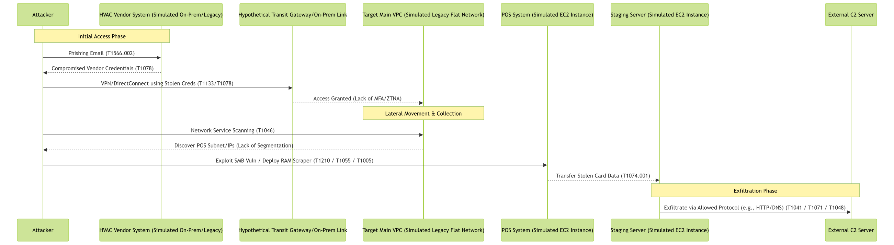


**Key Technical Failures & AWS Parallels:**
* **Insufficient Vendor Access Control:** Lack of MFA, static credentials. *AWS Context:* Modern approach uses AWS IAM Identity Center (SSO) with MFA, short-lived sessions, potentially AWS Verified Access or ZTNA solutions.
* **Flat Network Architecture:** Allowed easy lateral movement from vendor segment to POS segment. *AWS Context:* VPCs with Security Groups, NACLs, micro-segmentation patterns (Transit Gateway, VPC Peering with strict routing/SGs), and services like VPC Lattice prevent this.
* **Missing Egress Controls:** Exfiltration using common protocols (HTTP, DNS) went undetected. *AWS Context:* AWS Network Firewall, Route 53 Resolver DNS Firewall, VPC Flow Logs + GuardDuty provide egress monitoring and control.
* **Inadequate Endpoint Security:** RAM-scraping malware was not detected on POS systems. *AWS Context:* Amazon Inspector for vulnerabilities, SSM Patch Manager for patching, GuardDuty Runtime Monitoring (EC2/EKS), and third-party EDR integrations provide endpoint visibility.
* **Lack of Centralized Logging/Monitoring:** Delayed detection of scanning, malware deployment, and exfiltration. *AWS Context:* Centralized CloudTrail, CloudWatch Logs, Config Logs (via Control Tower Log Archive), Security Hub findings, and GuardDuty detections enable faster identification.

---

### **1.2 MITRE ATT&CK Mapping & AWS Controls**

| **Tactic (ATT&CK)** | **Technique Example (Target Breach)** | **Primary AWS Preventative/Detective Control(s)** |
| :------------------------ | :------------------------------------------ | :--------------------------------------------------------------------------------------------------------------------------------------------------- |
| **Initial Access** | T1199: Trusted Relationship (HVAC Vendor)   | IAM Identity Center (MFA, Conditional Access), Verified Access, Vendor-specific IAM Roles (Least Privilege)                                          |
|                           | T1566: Phishing                           | Email Security (SES + 3rd party), User Training, MFA                                                                                                 |
| **Discovery** | T1046: Network Service Scanning           | Security Groups (Deny unnecessary internal ports), GuardDuty (Reconnaissance findings), VPC Flow Logs                                                    |
| **Lateral Movement** | T1021: Remote Services (e.g., SMB/RDP)    | Security Groups (Deny inter-instance SMB/RDP), Network Firewall, Systems Manager Session Manager (replaces RDP/SSH), Micro-segmentation patterns       |
|                           | T1210: Exploitation of Remote Services    | SSM Patch Manager, Amazon Inspector, Network Firewall (IPS Signatures), EDR Agents                                                                     |
| **Collection** | T1005: Data from Local System (RAM Scraping) | GuardDuty Runtime Monitoring, EDR Agents (Memory Protection/Analysis), Principle of Least Privilege (Limit process permissions), Secure Coding (Minimize data in memory) |
| **Credential Access** | T1003: OS Credential Dumping              | GuardDuty Runtime Monitoring, EDR Agents (Credential Theft Protection), IAM Roles for EC2 (Avoid static keys), Secrets Manager                             |
| **Exfiltration** | T1041: Exfiltration Over C2 Channel       | AWS Network Firewall (Egress Filtering, FQDN Filtering), Route 53 Resolver DNS Firewall, VPC Flow Logs + GuardDuty, Macie (Detect sensitive data)        |
|                           | T1048: Exfiltration Over Alt. Protocol    | Route 53 Resolver DNS Firewall (for DNS Tunneling), Network Firewall (Protocol Inspection), Security Groups (Egress rules)                                 |

**Case Study Comparison: SolarWinds (Supply Chain)**
* **Similarity:** Initial access via trusted third-party (software update vs. vendor credentials). Both involved extensive lateral movement and C2 communication.
* **AWS Mitigation Differences:** While vendor access controls help, SolarWinds also requires supply chain security (AWS Signer for code integrity), strict change control for critical software, behavioral detection for trusted processes acting maliciously (GuardDuty Runtime, EDR), and micro-segmentation to limit the blast radius of compromised management tools.

---

### **1.3 Hands-On AWS CLI Examples (Detection & Prevention)**

**1. Detect Potential Lateral Movement Scanning (GuardDuty):**
```bash
# List findings related to EC2 reconnaissance activities
aws guardduty list-findings --detector-id <your-detector-id> \
  --finding-criteria '{
    "Criterion": {
      "resource.resourceType": {"Eq": ["Instance"]},
      "type": { "Eq": [
        "Recon:EC2/PortProbeUnprotectedPort",
        "Recon:EC2/Portscan"
      ]},
      "severity": {"Gte": 4} # Medium severity and above
    }
  }' \
  --query 'FindingIds' --output text --region <your-region>
# Note: Replace <your-detector-id> and <your-region>
```

**2. Block DNS Exfiltration Attempts (Route 53 Resolver DNS Firewall):**
```bash
# Assume 'dl-knownc2domains' is a FirewallDomainListId containing known C2 domains
# Create a rule group
aws route53resolver create-firewall-rule-group --name "BlockC2RuleGroup" --creator-request-id "$(uuidgen)" --region <your-region>
# Note the Rule Group ID: rslvr-frg-xxxxxxxxxxxxxxxxx

# Add a rule to the group to block the C2 domain list
aws route53resolver create-firewall-rule \
  --firewall-rule-group-id rslvr-frg-xxxxxxxxxxxxxxxxx \
  --firewall-domain-list-id dl-knownc2domains \
  --priority 10 \
  --action BLOCK \
  --block-response NODATA \
  --name "BlockKnownC2Domains" \
  --creator-request-id "$(uuidgen)" --region <your-region>

# Associate the rule group with a VPC
aws route53resolver associate-firewall-rule-group \
  --firewall-rule-group-id rslvr-frg-xxxxxxxxxxxxxxxxx \
  --vpc-id vpc-0abcdef1234567890 \
  --priority 101 \
  --name "VPCAssociationForBlockC2" --region <your-region>
```

---

### **1.4 Architecture Diagrams: Legacy vs. AWS ZT-Inspired**

**Legacy Flat Network (Target Analogy):**


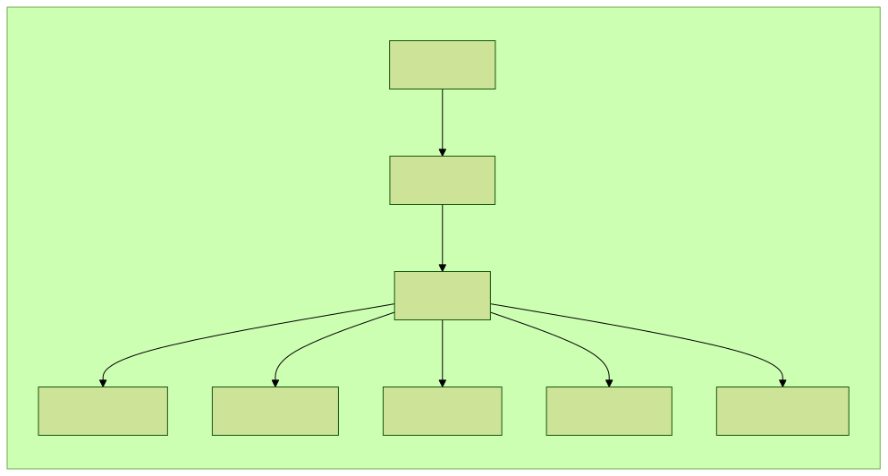


**Modern AWS Zero Trust-Inspired Architecture:**


*Note: This is conceptual; actual implementation uses Security Groups, NACLs, Network Firewall, etc., for enforcement.*

---

## Chapter 2: Zero Trust Architecture (ZTA) with AWS

---

### **2.1 Core ZTA Principles & AWS Service Alignment**

**Zero Trust Recap:** A security model based on the principle of "never trust, always verify." Assumes no implicit trust based on network location and requires continuous verification of identity, device posture, and context for every access request.

**ZTA Pillars & Corresponding AWS Services:**
1.  **Identity:** Verify and secure human and non-human identities.
    * *AWS Services:* IAM Identity Center (SSO/MFA), IAM (Users, Roles, Policies, Conditions), AWS Certificate Manager Private CA (Service Identity), AWS Directory Service, Cognito (Customer Identity).
2.  **Device:** Assess device health and posture before granting access.
    * *AWS Services:* AWS Verified Access (Integrates with EDR/MDM for posture checks), Systems Manager (Inventory, Compliance), IoT Device Defender (for IoT devices). Requires integration with third-party MDM/EDR for comprehensive checks.
3.  **Network:** Segment networks, encrypt traffic, control flows based on policy.
    * *AWS Services:* VPC (Security Groups, NACLs, Subnets), AWS Network Firewall, Route 53 Resolver DNS Firewall, VPC Lattice (Service-to-service auth/authz), AWS PrivateLink, Transit Gateway (Segmentation), VPN, Direct Connect, TLS (ACM, ELB/CloudFront policies).
4.  **Application/Workload:** Secure application access, APIs, and runtime environments.
    * *AWS Services:* IAM Roles for services (EC2, Lambda), Lambda Authorizers, API Gateway Authorizers, VPC Lattice (Auth policies), AWS WAF, AWS Shield, Inspector (Container/Lambda scanning), Nitro Enclaves (Confidential Computing).
5.  **Data:** Classify, protect, and govern access to data.
    * *AWS Services:* Amazon Macie, AWS KMS, S3 (Encryption, Policies, Access Points), RDS Encryption, EBS Encryption, Secrets Manager, IAM data access policies, Lake Formation (Data Lake governance).
6.  **Visibility & Analytics:** Monitor activity, detect threats, analyze logs.
    * *AWS Services:* CloudTrail, CloudWatch Logs, VPC Flow Logs, GuardDuty, Security Hub, Amazon Detective, Config.
7.  **Automation & Orchestration:** Automate security tasks and response actions.
    * *AWS Services:* EventBridge, Lambda, Step Functions, Systems Manager Automation.

**Simplified ZTA Conceptual Flow on AWS:**


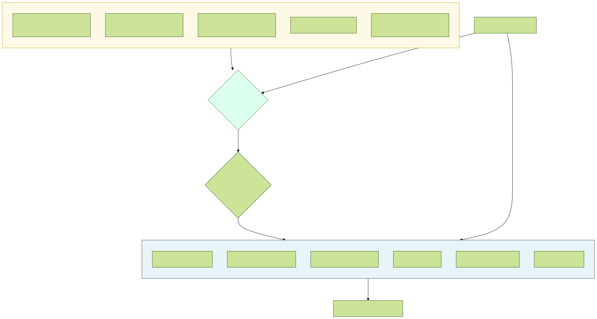


---

### **2.2 Hands-On ZTA Implementation Examples**

**1. Require MFA and Specific Role Tag for EC2 Access via SSM Session Manager:**
```json
{
    "Version": "2012-10-17",
    "Statement": [
        {
            "Sid": "AllowSSMSessionManagerWithTagsAndMFA",
            "Effect": "Allow",
            "Action": "ssm:StartSession",
            "Resource": [
                "arn:aws:ec2:*:*:instance/*",
                "arn:aws:ssm:*:*:document/AWS-StartPortForwardingSession", 
                "arn:aws:ssm:*:*:document/AWS-StartSSHSession"
            ],
            "Condition": {
                "Bool": {"aws:MultiFactorAuthPresent": "true"},
                "StringEquals": {
                    "ssm:resourceTag/AccessLevel": "Privileged", 
                    "aws:PrincipalTag/JobFunction": "SysAdmin" 
                },
                "StringLike": { 
                    "aws:userId": ["AROAIXXXXXXXXXXXXXXXX:*", "AIDAIYYYYYYYYYYYYYYY:*"]
                }
            }
        },
         { 
             "Sid": "DenySSMWithoutMFA",
             "Effect": "Deny",
             "Action": "ssm:StartSession",
             "Resource": "*",
             "Condition": { "BoolIfExists": {"aws:MultiFactorAuthPresent": "false"} }
         }
    ]
}
```
```bash
# Tag the target EC2 instance
aws ec2 create-tags --resources i-0abcdef1234567890 --tags Key=AccessLevel,Value=Privileged --region <your-region>

# Attempt to start session (will fail without MFA or if tag mismatch)
# aws ssm start-session --target i-0abcdef1234567890 --region <your-region>
```

**2. Configure VPC Lattice Service Network with IAM Authentication:**
```bash
# Create a service network requiring IAM authentication
aws vpc-lattice create-service-network \
  --name "zta-internal-services" \
  --auth-type AWS_IAM \
  --region <your-region>
# Note the Service Network ARN/ID

# Create a VPC Lattice Service associated with target (e.g., EC2, Lambda, K8s)
# aws vpc-lattice create-service --name "my-app-service" --custom-domain-name myapp.internal --auth-type AWS_IAM ...

# Create a Service Network VPC Association (Link VPC to Service Network)
# aws vpc-lattice create-service-network-vpc-association --service-network-identifier <sn-id> --vpc-identifier <vpc-id> ...

# Apply an Auth Policy to the Service Network or Service
# Policy allows specific IAM roles/users to access services in the network
aws vpc-lattice put-auth-policy \
  --resource-identifier <service-network-or-service-arn> \
  --policy '{
    "Version": "2012-10-17",
    "Statement": [
        {
            "Effect": "Allow",
            "Principal": { "AWS": [ "arn:aws:iam::123456789012:role/AppClientRoleA", "arn:aws:iam::123456789012:user/Bob" ] },
            "Action": "vpc-lattice-svcs:Invoke",
            "Resource": "*"
            # Optionally add conditions based on source VPC, tags etc.
        }
    ]
  }' \
  --region <your-region>
```

---

### **2.3 Case Study: Colonial Pipeline Ransomware (2021)**

* **Attack:** Ransomware attack initiated via compromise of a single legacy VPN account credential found on the dark web. Lack of MFA on the VPN was a critical failure. The attack impacted IT systems, forcing a precautionary shutdown of OT (Operational Technology) pipeline operations.
* **Failures:** Single-factor authentication on critical remote access (VPN); potentially insufficient network segmentation between IT and OT environments (though OT was reportedly not directly breached, the shutdown was precautionary); potentially slow incident response/containment.
* **AWS ZTA Mitigation Strategy:**
    * **Identity (VPN/Remote Access):** Replace legacy VPN with modern ZTNA solution or AWS Client VPN enforcing **MFA** via integration with IAM Identity Center or other IdP. Apply **Conditional Access** policies requiring compliant devices (using Verified Access concepts if possible) and restricting access based on location/risk. Implement **short session timeouts**.
    * **Network Segmentation:** Strict VPC segmentation using Security Groups, Network Firewalls, and potentially Transit Gateway to isolate critical OT simulation/management segments (if migrated to AWS) from general IT/remote access segments. Deny all unnecessary protocols between zones. Use VPC Lattice or PrivateLink for controlled service-to-service communication.
    * **Least Privilege:** Ensure the compromised VPN account (or any remote access account) did *not* have broad network access or administrative privileges on downstream systems. Apply least privilege IAM roles.
    * **Visibility & Response:** GuardDuty for detecting unusual access patterns or C2 activity. Security Hub findings trigger automated Lambda/SSM actions to disable compromised accounts (`iam:DeleteLoginProfile`, `iam:UpdateAccessKey`) or isolate source IPs/instances within minutes.

---

### **2.4 ZTA Maturity & Challenges**

**ZTA is a Journey:** Organizations typically progress through maturity levels:
1.  **Basic:** Stronger IAM/MFA, basic network segmentation.
2.  **Intermediate:** Device posture checks, more granular segmentation, application-level controls (API gateways, WAF).
3.  **Advanced:** Dynamic/contextual policies (Conditional Access), continuous verification, micro-segmentation, UEBA integration, automated response.

**Challenges in Implementation:**
* **Legacy Systems:** Integrating systems lacking modern identity/security features requires compensating controls (gateways, proxies, strict segmentation).
* **Complexity:** Defining and managing granular policies across identity, device, network, app, and data can be complex. Requires robust tooling, automation (Policy as Code), and clear ownership.
* **User Experience:** Overly strict or poorly implemented ZTA can hinder productivity. Balancing security with usability is key (e.g., adaptive MFA, risk-based step-up authentication).
* **Visibility:** Comprehensive visibility across all pillars is essential for effective policy decisions and monitoring. Requires integration between tools (achievable via Security Hub, log aggregation).
* **Cost:** Implementing ZTA often requires investment in new tools (IdP, PAM, EDR, ZTNA, segmentation solutions) and skilled personnel.

**Measuring ZTA Success:**
* Reduction in successful breaches/lateral movement incidents.
* Improved audit/compliance posture.
* Faster incident detection and response times (MTTD, MTTR).
* Reduced reliance on broad network access controls.
* Metrics mapped back to SABSA business attributes (e.g., improved Confidentiality attribute score).

---

## Chapter 3: Micro-Segmentation & Network Hardening on AWS

---

### **3.1 AWS Network Segmentation Techniques**

**Goal:** Limit the blast radius of a potential breach by dividing networks into smaller, isolated zones based on sensitivity, function, or trust level, enforcing the principle of least privilege at the network layer.

**AWS Native Segmentation Tools:**
* **VPCs & Subnets:** Foundation layer. Use multiple VPCs for major environment separation (Prod/Dev, Compliance scope). Use public, private, and isolated subnets within VPCs.
* **Security Groups (SGs):** Stateful L4 firewalls associated with ENIs/instances/services. Act as instance-level firewalls. Best practice: Allow only specific required ports/protocols from specific source SGs or IP ranges (default deny).
* **Network Access Control Lists (NACLs):** Stateless L4 firewalls associated with subnets. Act as a blunt instrument for broad subnet-level blocks (e.g., blocking ephemeral ports, known bad IPs). Rules evaluated in order. Use sparingly as SGs are typically preferred for granular control.
* **AWS Transit Gateway (TGW):** Centralized hub for connecting multiple VPCs and on-premises networks. Enables segmentation via Route Tables associated with TGW attachments. Allows granular control over which VPCs/on-prem networks can communicate.
* **VPC Endpoints (Gateway & Interface):** Keep traffic to AWS services (S3, DynamoDB, KMS, etc.) within the AWS network using Gateway Endpoints (via route tables) or Interface Endpoints (ENIs within your VPC). Endpoint Policies provide resource-based access control.
* **AWS PrivateLink:** Provides private connectivity between VPCs, AWS services, and on-premises networks without exposing traffic to the public internet, traversing NAT devices, or using overlapping IP addresses. Uses Interface Endpoints.
* **AWS Network Firewall:** Managed stateful L7 firewall service. Deployed within VPCs. Provides IDS/IPS capabilities (using Suricata rule sets - managed or custom), domain list filtering, protocol inspection, and granular traffic control between subnets or VPCs (often used with TGW).
* **VPC Lattice:** Application-layer service networking. Connects and secures communications between services across VPCs and accounts using application-layer policies (IAM auth, context-based access) rather than just IP/port rules. Enables fine-grained micro-segmentation at the service interaction level.

**Choosing the Right Tool:**
* Instance-level control -> Security Groups.
* Subnet-level blocking -> NACLs (use cautiously).
* Inter-VPC/On-Prem routing & segmentation -> Transit Gateway.
* Private access to AWS Services -> VPC Endpoints.
* Private service exposure/consumption across VPCs -> PrivateLink / VPC Lattice.
* Advanced L7 inspection/IPS -> Network Firewall.
* Service-to-service L7 auth/authz -> VPC Lattice.

**Conceptual Multi-Tier Web App Segmentation:**


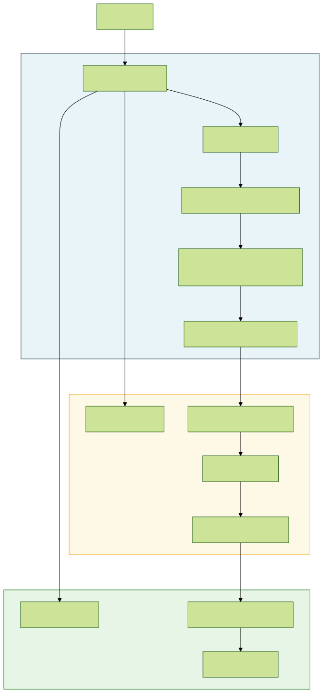


*Note: SGs control traffic between ALB->Web, Web->App Endpoint, App->DB Endpoint. TGW routing controls VPC-to-VPC.*

---

### **3.2 Hands-On: Security Groups, NACLs, Network Firewall**

**1. Implement Strict Security Group Rules:**
```bash
# Assume Web SG ID: sg-web123, App SG ID: sg-app456
# Allow HTTPS from ALB (assuming ALB uses sg-alb789) to Web Fleet
aws ec2 authorize-security-group-ingress --group-id sg-web123 \
  --protocol tcp --port 443 --source-group sg-alb789 --region <your-region>

# Allow Web Fleet SG to talk to App Fleet SG on custom port 8080
aws ec2 authorize-security-group-ingress --group-id sg-app456 \
  --protocol tcp --port 8080 --source-group sg-web123 --region <your-region>

# Deny all inbound by default (implicit), review outbound rules (restrict if possible)
# aws ec2 describe-security-groups --group-ids sg-web123 sg-app456 --query "SecurityGroups[*].{ID:GroupId, Ingress:IpPermissions, Egress:IpPermissionsEgress}"
```

**2. Use NACL to Block Known Bad IPs at Subnet Level:**
```bash
# Assume NACL ID: acl-12345678 for a public subnet
# Add inbound DENY rule for a known malicious IP range (rule num < allow rules)
aws ec2 create-network-acl-entry --network-acl-id acl-12345678 \
  --rule-number 90 --protocol tcp --port-range From=0,To=65535 \
  --rule-action deny --cidr-block 203.0.113.0/28 \
  --ingress --region <your-region>

# Add corresponding outbound DENY rule (NACLs are stateless)
aws ec2 create-network-acl-entry --network-acl-id acl-12345678 \
  --rule-number 90 --protocol tcp --port-range From=0,To=65535 \
  --rule-action deny --cidr-block 203.0.113.0/28 \
  --egress --region <your-region>
```

**3. Configure AWS Network Firewall Rule Group (Stateful):**
```json
{
  "RulesSource": {
    "StatefulRules": [
      {
        "Action": "DROP",
        "Header": {
          "Protocol": "TCP",
          "Source": "Any",
          "SourcePort": "Any",
          "Direction": "FORWARD",
          "Destination": "Any",
          "DestinationPort": "445" 
        },
        "RuleOptions": [
          { "Keyword": "sid:2000001" },
          { "Keyword": "msg", "Settings": ["Outbound SMB traffic blocked"] },
          { "Keyword": "rev:1" }
        ]
      }
    ]
  }
}
```
```bash
# Create the rule group
aws network-firewall create-rule-group \
    --rule-group-name "BlockOutboundSMB" \
    --type STATEFUL \
    --capacity 100 \
    --rule-group file://block-smb.json \
    --region <your-region>

# Add this rule group to a Network Firewall Policy, then associate policy with Firewall
# aws network-firewall update-firewall-policy ...
# aws network-firewall associate-firewall-policy ...
```

---

### **3.3 Case Study: Marriott/Starwood Breach (2014-2018)**

* **Attack:** Attackers initially compromised Starwood's network. After Marriott acquired Starwood (2016), the attackers leveraged the existing foothold and potentially inadequate segmentation/monitoring during the network integration phase to move laterally into Marriott systems containing payment card and PII data from the Starwood reservation database.
* **Failures:** Insufficient security due diligence during M&A; inadequate network segmentation between the acquired (Starwood) and acquiring (Marriott) networks; potential lack of visibility/monitoring in the acquired environment; prolonged dwell time allowing extensive data access and exfiltration.
* **AWS Mitigation Strategy (for hypothetical merged cloud environments):**
    * **M&A Security Due Diligence:** Thoroughly assess the security posture of acquired cloud environments *before* integration using tools like Security Hub, Inspector, Config, GuardDuty, and potentially third-party CSPM tools.
    * **Phased Integration with Strict Segmentation:** Do *not* immediately bridge networks. Initially, keep acquired AWS accounts/VPCs isolated within the AWS Organization. Use **Transit Gateway** with highly restrictive route tables and **Network Firewall** policies to allow only absolutely essential, inspected traffic between environments during migration phases. Apply strict **SCPs** to the acquired accounts OU.
    * **Identity Federation:** Federate identities using IAM Identity Center but apply strict permission boundaries and Conditional Access policies to roles assumed cross-environment. Avoid trusting identities from the acquired environment implicitly.
    * **Centralized Monitoring:** Immediately onboard acquired accounts into the central Security Hub, GuardDuty, Config Aggregator, and logging accounts for unified visibility. Deploy standard monitoring and alerting.
    * **Data Migration Security:** If migrating data, use Macie to scan for sensitive data first. Use secure transfer methods (e.g., DataSync with encryption, PrivateLink) and ensure target environment (e.g., S3 buckets, RDS databases) have appropriate encryption and access controls applied *before* migration.

---

### **3.4 Advanced Segmentation: VPC Lattice & Endpoint Policies**

**Beyond L4:** Traditional segmentation focuses on IP/ports (L4). Modern threats often leverage allowed ports. Advanced techniques focus higher up the stack.

* **VPC Lattice:** Provides application-layer (L7) segmentation for service-to-service communication.
    * **How:** Services register with Lattice. Clients discover services via Lattice DNS. Policies applied at the Service Network or individual Service level use **IAM Auth** and **Context Attributes** (source VPC, tags, HTTP headers) to authorize connection attempts *before* traffic reaches the service instance.
    * **Benefit:** Decouples service access control from network topology. Allows policies like "Allow only services with tag `Project=X` from VPC `vpc-abc` to call the `Payment` service's `/process` endpoint."
* **VPC Endpoint Policies:** Resource-based IAM policies attached to Interface or Gateway VPC Endpoints.
    * **How:** Control which principals (users, roles, AWS services) or resources (VPCs, accounts) can use the endpoint, and which actions they can perform on the connected service (e.g., S3, DynamoDB, KMS).
    * **Benefit:** Restricts access to AWS services even for principals with broad IAM permissions if they aren't coming through an allowed endpoint or don't meet endpoint policy conditions. Adds another layer of defense-in-depth. Example: Allow an EC2 instance's role to access *only* a specific S3 bucket via the VPC Gateway Endpoint.

**Endpoint Policy Example (S3 Gateway Endpoint):**
```json
{
  "Statement": [
    {
      "Sid": "Access-to-specific-bucket-only",
      "Principal": "*",
      "Action": [
        "s3:GetObject",
        "s3:PutObject"
      ],
      "Effect": "Allow",
      "Resource": [
        "arn:aws:s3:::my-sensitive-data",
        "arn:aws:s3:::my-sensitive-data/*"
      ]
    }
  ]
}
```
```bash
# Apply policy to the VPC Endpoint
aws ec2 modify-vpc-endpoint --vpc-endpoint-id vpce-0123456789abcdef0 \
  --policy-document file://endpoint-policy.json --region <your-region>
```

---

## Chapter 4: AI-Driven Threat Detection & Response on AWS

---

### **4.1 AI/ML in AWS Security Services**

**Leveraging Machine Learning for Detection:** Traditional signature-based detection struggles with novel threats and stealthy techniques. AI/ML offers enhanced capabilities through anomaly detection, behavioral analysis, and pattern recognition at scale.

**Key AWS Services Using AI/ML:**
* **Amazon GuardDuty:** Core threat detection service heavily reliant on ML.
    * **Anomaly Detection:** Baselines normal CloudTrail activity, VPC Flow Logs, DNS logs, and runtime behavior (EC2/EKS), then identifies deviations (e.g., unusual API calls, connections to known C2 IPs, port scanning, crypto-mining behavior, anomalous S3 access).
    * **Behavioral Modeling:** Models typical IAM principal behavior to detect compromised credentials or insider threats (`CredentialAccess:IAMUser/AnomalousBehavior`).
    * **Integrated Threat Intelligence:** Combines ML findings with AWS and third-party threat feeds (malicious IPs/domains).
* **Amazon Macie:** Uses ML models trained to recognize patterns indicative of sensitive data (PII, financial, credentials) within S3 objects, going beyond simple regex matching. Continuously evaluates S3 security posture using ML.
* **Amazon Detective:** Uses ML and graph theory to automatically analyze related GuardDuty findings, CloudTrail logs, and VPC Flow Logs to visualize potential security incidents, identify root causes, and streamline investigations. Builds behavior graphs for resources.
* **AWS WAF (Bot Control & Fraud Control):** Managed rule groups use ML models to identify and block sophisticated bots (Bot Control) and detect fraudulent activity like account creation fraud or takeover attempts (Account Takeover Prevention - ATP).
* **Amazon CodeGuru Security:** Uses ML models trained on security best practices and vulnerability patterns to automatically detect security flaws in application code during development.
* **AWS Security Hub (Insights):** While primarily an aggregator, Security Hub uses correlation logic (potentially ML-assisted in the future) to group related findings into "Insights," helping prioritize investigation.

**Conceptual ML Detection Process in GuardDuty:**


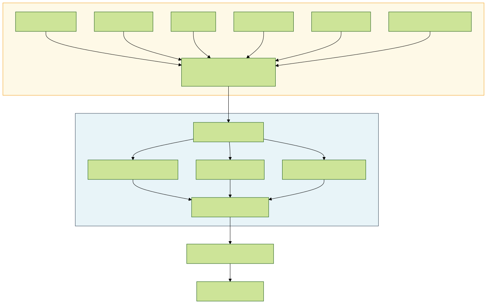


---

### **4.2 Integrating GuardDuty, Security Hub & Detective**

**Synergistic Workflow:** These three services are designed to work together for a more effective detection, investigation, and response posture.

1.  **Detection (GuardDuty):** Identifies potential threats and suspicious activities across various data sources using ML and threat intel. Generates detailed findings.
2.  **Aggregation & Prioritization (Security Hub):** Centralizes findings from GuardDuty (and other services like Inspector, Macie, Config, third-parties). Applies severity scoring, maps findings to compliance standards (e.g., CIS, PCI DSS), correlates related findings into "Insights," and enables filtering/searching across all findings. Acts as the central hub for monitoring security posture.
3.  **Investigation (Detective):** When a complex finding or Insight appears in Security Hub/GuardDuty, Detective can be used to automatically investigate. It ingests logs related to the involved resources (EC2 instances, IAM users/roles, IP addresses) over time, builds a behavior graph, and visualizes connections and activities associated with the finding. This significantly speeds up root cause analysis and scope determination compared to manual log diving.

**Integration Flow:**


---

### **4.3 Hands-On: Investigating Findings with Detective & Security Hub**

**1. Review Correlated Findings in Security Hub Insights:**
```bash
# List active, high/critical severity insights
aws securityhub get-insights \
    --filters '{ "SeverityLabel": [{"Value": "HIGH", "Comparison": "EQUALS"}, {"Value": "CRITICAL", "Comparison": "EQUALS"}], "RecordState": [{"Value": "ACTIVE", "Comparison": "EQUALS"}] }' \
    --query 'Insights[*].{Name:Name, InsightArn:InsightArn, Severity:Severity.Label, FindingCount:ResultCount}' \
    --output table --region <your-region>

# Get findings associated with a specific insight
aws securityhub get-findings \
    --filters '{ "InsightArn": [{"Value": "arn:aws:securityhub:<region>:<account>:insight/...", "Comparison": "EQUALS"}] }' \
    --query 'Findings[*].{Id:Id, Title:Title, Type:Types[0], Resource:Resources[0].Id}' \
    --output table --region <your-region>
```
*(Review the related findings in the console for context)*

**2. Initiate Investigation in Amazon Detective (from GuardDuty Finding):**
```bash
# Find a GuardDuty finding ID (e.g., from list-findings or Security Hub)
GUARDDUTY_FINDING_ID="123abc456def789..."
GUARDDUTY_DETECTOR_ID="d1abc23def" # Your GuardDuty detector ID

# Get the finding details to extract the ARN
FINDING_ARN=$(aws guardduty get-findings --detector-id $GUARDDUTY_DETECTOR_ID --finding-ids $GUARDDUTY_FINDING_ID --query 'Findings[0].Arn' --output text --region <your-region>)

# Start investigation in Detective (creates a behavior graph if one doesn't exist)
# This often involves navigating from the finding in the GuardDuty/Security Hub console
# CLI doesn't directly "start investigation" but you can list graph details
aws detective list-graphs --query 'GraphList[*].Arn' --output text --region <your-region>
GRAPH_ARN="arn:aws:detective:<region>:<account>:graph:..."

# List entities involved in a finding (using Detective API linked from console)
# This requires navigating from the finding in the console usually,
# or using specific Detective API calls like ListIndicators / GetMembers with graph ARN
# Example conceptual call structure:
# aws detective list-indicators --graph-arn $GRAPH_ARN --indicator-type TTP_OBSERVED --finding-arn $FINDING_ARN ...

# More practical: Use the console link from GuardDuty/Security Hub finding
# which pre-populates Detective with the finding context.
```
*(Detective is primarily investigation-focused via the Console)*

**3. Create Custom Action in Security Hub to Trigger Enrichment Lambda:**
```bash
# Create a custom action
aws securityhub create-action-target \
    --name "Enrich-IP-Address" \
    --description "Sends IP address from finding to Lambda for threat intel enrichment" \
    --id "EnrichIPLambda" \
    --region <your-region>
# Note the ActionTargetArn from output

# Create an EventBridge rule that listens for this custom action
aws events put-rule \
    --name "SecurityHubCustomActionEnrichIP" \
    --event-pattern '{
        "source": ["aws.securityhub"],
        "detail-type": ["Security Hub Custom Action"],
        "resources": ["<ActionTargetArn_from_previous_step>"]
    }' \
    --state ENABLED

# Add your enrichment Lambda function as a target to this rule (similar to step 7.3.2)
# aws events put-targets --rule "SecurityHubCustomActionEnrichIP" --targets ...
# aws lambda add-permission ...
```
*(Now, analysts can select findings in Security Hub and invoke the "Enrich-IP-Address" action)*

---

### **4.4 Case Study: Crypto-mining Malware on EC2**

* **Attack:** Attacker compromises an EC2 instance (e.g., via unpatched vulnerability, weak credentials) and installs crypto-mining software (like XMRig). The malware consumes significant CPU resources and communicates with mining pool servers over specific ports/protocols.
* **Detection (GuardDuty):**
    * `CryptoCurrency:EC2/BitcoinTool.B!DNS`: Detects DNS requests associated with known crypto-mining pools.
    * `Execution:EC2/SuspiciousFile`: Detects execution of known crypto-miner binaries (if runtime monitoring enabled).
    * `Impact:EC2/MaliciousDomainRequest.Reputation`: Detects communication with domains on threat lists often associated with mining pools or malware C2.
    * `Impact:EC2/NetworkPortUnusual`: Detects outbound communication on ports commonly used by miners if they are unusual for the instance profile.
    * `Behavior:EC2/InstanceMetadataServiceUsage`: Might detect unusual metadata queries if the attacker attempts privilege escalation.
* **AWS Mitigation & Response Strategy:**
    * **Detection:** GuardDuty generates findings listed above -> Sends to Security Hub.
    * **Alerting:** EventBridge rule filters for high/critical severity `CryptoCurrency:` or related findings -> Notifies SOC via SNS.
    * **Automated Containment (Lambda/SSM triggered by EventBridge):**
        1.  Immediately apply a "Quarantine" Security Group to the affected instance ID (extracted from the finding) to block all mining pool communication and lateral movement attempts.
        2.  (Optional) Use SSM Run Command to attempt to terminate the mining process on the instance (may fail if attacker has root).
        3.  (Optional) Trigger an EBS snapshot of the instance's root volume for later forensic analysis.
    * **Investigation (Detective/Manual):** Analyst uses Detective (linked from GuardDuty/Security Hub finding) to visualize the instance's network connections, API calls (via CloudTrail), and related findings to understand the initial compromise vector (if possible) and scope. Manually review logs (VPC Flow Logs, instance logs via SSM).
    * **Eradication/Recovery:** Terminate the compromised instance. Redeploy a clean instance from a golden AMI using IaC (CloudFormation/Terraform). Ensure the initial vulnerability or misconfiguration is fixed. Rotate any potentially compromised credentials.

---

## Chapter 5: Endpoint Security & XDR on AWS

---

### **5.1 Endpoint Security Services & XDR Concepts on AWS**

**Core AWS Endpoint Security Services:**
* **AWS Systems Manager (SSM):** Provides visibility and control of infrastructure on AWS and on-premises. Key features include Patch Manager, Run Command, State Manager, Inventory. Aligns with operational security and configuration management.
* **Amazon Inspector:** Automated vulnerability management service that continually scans AWS workloads (EC2, Containers in ECR/EC2, Lambda functions) for software vulnerabilities (CVEs) and unintended network exposure. Maps to vulnerability management processes.
* **AWS Security Hub:** Aggregates security findings from various AWS services (GuardDuty, Inspector, Macie, IAM Access Analyzer, SSM Patch Manager) and integrated third-party products. Enables centralized monitoring and compliance checks. Facilitates automated response triggers.
* **Amazon GuardDuty:** Threat detection service that continuously monitors for malicious activity and unauthorized behavior using ML, anomaly detection, and integrated threat intelligence. Includes EKS Runtime Monitoring and EC2 instance runtime monitoring capabilities.

**XDR (Extended Detection & Response) on AWS:**
While AWS doesn't offer a single "XDR" product, a comprehensive XDR-like capability can be achieved by integrating native services and potentially third-party EDR solutions:
1.  **Telemetry Collection:** GuardDuty (Network, CloudTrail, DNS, EKS, S3, EC2 Runtime), Inspector (Vulnerabilities), Security Hub (Aggregated Findings), VPC Flow Logs, CloudTrail Logs, EDR Agents (e.g., CrowdStrike Falcon, SentinelOne).
2.  **Detection & Analysis:** GuardDuty's ML/AI, Security Hub insights, Amazon Detective for investigation, potentially Amazon OpenSearch Service or Athena for log analysis/threat hunting.
3.  **Response:** AWS Systems Manager (Run Command, Automation), AWS Lambda triggered by EventBridge rules from Security Hub/GuardDuty findings, AWS Step Functions for complex workflows.

**Conceptual XDR Data Flow on AWS:**


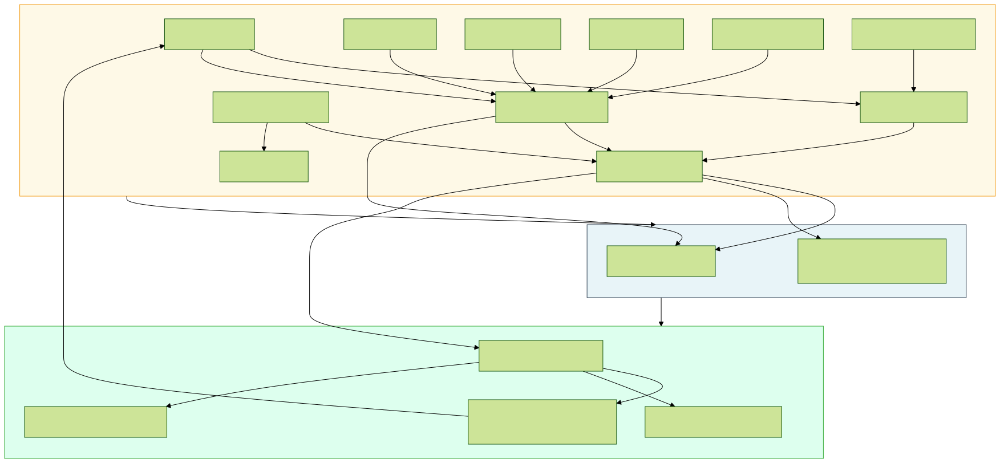


---

### **5.2 EDR/XDR Agent Integration**

**Integrating Third-Party EDR with AWS Security Hub:**
Many leading EDR vendors (e.g., CrowdStrike, SentinelOne, Trend Micro) integrate with AWS Security Hub using the AWS Security Finding Format (ASFF).
* **Benefits:** Centralized visibility of both AWS-native findings and EDR detections; correlation possibilities within Security Hub or downstream SIEM/SOAR; triggering unified response actions via EventBridge.
* **Mechanism:** EDR vendor's cloud platform pushes relevant alerts (formatted as ASFF) to a designated AWS Security Hub instance via IAM roles and API calls.

**Deployment Considerations:**
* **Agent Deployment:** Use AWS Systems Manager Distributor and State Manager or EC2 Launch Templates/AMIs to automate agent deployment and ensure consistency across EC2 fleets. For containers, integrate agent deployment into the container image build process or use sidecar containers/daemonsets (EKS).
* **IAM Permissions:** Ensure EDR management roles and integration points have least-privilege IAM permissions.
* **Data Routing:** Understand where EDR telemetry is sent (vendor cloud vs. customer environment) and associated security/privacy implications.

**Simplified Agent Deployment Workflow (SSM):**


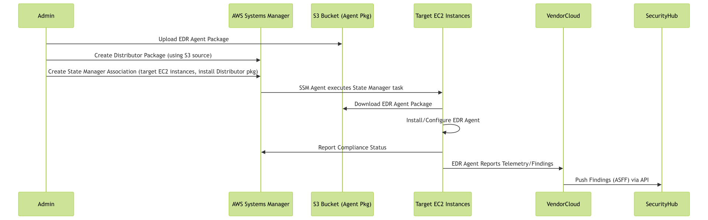


---

### **5.3 Hands-On: Vulnerability Scanning & Patching**

**1. Enable and Review Amazon Inspector Findings:**
```bash
# Ensure Inspector is enabled (v2 uses continuous scanning)
# Check via Console or CLI:
aws inspector2 batch-get-account-status --query 'accounts[?resourceState.ec2.status==`ENABLED`]'

# List critical CVE findings for EC2 instances
aws inspector2 list-findings \
    --filter-criteria '{ "severity": [{"comparison": "EQUALS", "value": "CRITICAL"}], "resourceType": [{"comparison": "EQUALS", "value": "AWS_EC2_INSTANCE"}] }' \
    --query 'findings[*].{InstanceId:resourceId, Title:title, Severity:severity, CVSS:cvssScore, FirstSeen:firstObservedAt}' \
    --output table --region us-east-1 # Specify your region

# Describe a specific finding for details
aws inspector2 batch-get-finding-details --finding-arns "arn:aws:inspector2:us-east-1:123456789012:finding/..." --query 'findingDetails[*]'
```

**2. Use SSM Patch Manager to Apply Patches:**
```bash
# Define a patch baseline (example: Critical Linux patches approved after 7 days)
# Often done via Console, but CLI possible (complex JSON)
# aws ssm create-patch-baseline --name "MyLinuxCriticalBaseline" --operating-system "AMAZON_LINUX_2" --approval-rules ...

# Scan instances for missing patches against a baseline
aws ssm start-associations-once \
    --association-ids "AWS-RunPatchBaseline" \
    --targets Key=InstanceIds,Values=i-0abcdef1234567890

# (Check results in Patch Manager Console or via list-compliance-summaries)

# Apply missing patches (Install operation) - SCHEDULED via Maintenance Windows typically
# Manual trigger for example:
aws ssm send-command \
    --document-name "AWS-RunPatchBaseline" \
    --targets Key=InstanceIds,Values=i-0abcdef1234567890 \
    --parameters '{"Operation":["Install"]}' \
    --comment "Applying critical patches"
```

---

### **5.4 Case Study: WannaCry Ransomware (2017)**

* **Attack:** Exploited unpatched SMBv1 vulnerability (MS17-010, "EternalBlue") on Windows systems. Spread rapidly within networks, encrypting files.
* **Failures:** Slow/incomplete patching; flat networks allowing rapid SMB propagation; lack of endpoint detection for exploit/ransomware behavior.
* **AWS Mitigation Strategy:**
    * **Patching (SSM Patch Manager):** Regularly apply critical OS patches identified by Inspector scans using automated patching baselines and maintenance windows. This directly addresses the root cause vulnerability.
    * **Network Segmentation (Security Groups/NACLs):** Strictly limit SMB (TCP 445, 139) access between instances using Security Groups. Apply NACLs as a stateless backstop. Deny unnecessary inbound/outbound SMB traffic.
    * **Threat Detection (GuardDuty):** GuardDuty can detect reconnaissance activity (port scanning) and potentially anomalous SMB behavior patterns.
    * **Endpoint Detection (EDR/Inspector):** Inspector identifies the missing MS17-010 patch. Integrated EDR agents would detect exploit attempts (EternalBlue signatures/heuristics) and ransomware file encryption behavior.
    * **Automated Response (Security Hub + Lambda/SSM):** A high-severity EDR finding (ransomware detected) or GuardDuty finding (exploit detected) sent to Security Hub can trigger a Lambda function via EventBridge. The Lambda function can use SSM Run Command to isolate the instance (e.g., modify firewall rules locally) or EC2 APIs to change its Security Group to a quarantine group, preventing further spread within seconds/minutes.

---

## Chapter 6: Data Security & Privacy Controls on AWS

---

### **6.1 Data Classification, Discovery & Encryption**

**Data Sensitivity Identification:**
* **Amazon Macie:** A fully managed data security and data privacy service that uses ML and pattern matching to discover and protect sensitive data in Amazon S3. Identifies PII (Personally Identifiable Information), financial data, credentials, PHI (Protected Health Information), and allows custom data identifiers. Crucial for understanding *what* data needs protection and where it resides. Aligns with GDPR/CCPA requirements.

**Encryption at Rest:**
* **Amazon S3:** Default encryption (SSE-S3 AES-256), Server-Side Encryption with KMS keys (SSE-KMS), or Client-Side Encryption. Bucket policies can enforce encryption on upload.
* **Amazon EBS:** Default encryption can be enabled per region. Uses AWS managed KMS keys or Customer Managed Keys (CMKs). Transparent to EC2 instances.
* **Amazon RDS:** Encrypts databases using AWS KMS (managed or CMK). Encrypts underlying storage, automated backups, read replicas, and snapshots.
* **AWS Key Management Service (KMS):** Centralized control over cryptographic keys. Creates and manages CMKs, controls key usage policies (who/what can encrypt/decrypt). Integrates with most AWS services supporting encryption. FIPS 140-2 validated HSMs available.

**Encryption in Transit:**
* **TLS/SSL:** Use AWS Certificate Manager (ACM) to provision and manage public/private TLS certificates for services like Load Balancers (ALB/NLB), CloudFront, API Gateway. Enforce TLS 1.2 or higher.
* **VPC Endpoints/PrivateLink:** Keep traffic between VPCs and AWS services (S3, DynamoDB, KMS etc.) off the public internet.
* **Client-Side Encryption:** Encrypt data before sending it to AWS (e.g., using AWS Encryption SDK).

**Data Protection Architecture Snippet:**


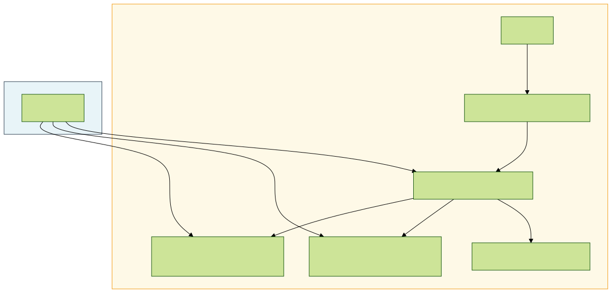


---

### **6.2 Data Loss Prevention (DLP) on AWS**

**DLP Concepts:** Preventing unauthorized exfiltration or exposure of sensitive data. Involves monitoring data at rest, in use, and in motion.
**AWS Native DLP-Related Capabilities:**
* **Amazon Macie:** Primarily focused on discovering sensitive data *at rest* in S3. Can generate findings for sensitive data in publicly accessible buckets or unencrypted buckets, alerting on potential exposure risks.
* **Amazon GuardDuty (S3 Protection):** Detects suspicious access patterns to S3 data (e.g., access from unusual locations, anomalous data volume access, potential credential compromise accessing data). Also detects potentially malicious infrastructure trying to exfiltrate data *from* EC2/Containers.
* **VPC Flow Logs & Traffic Mirroring:** Can provide network visibility for analysis by third-party Network DLP solutions or custom analysis (e.g., looking for large outbound transfers).
* **AWS WAF:** Can inspect web request/response bodies for specific patterns (e.g., credit card numbers using regex), providing DLP capabilities for web applications, although primarily focused on inbound threats.
* **IAM Policies & S3 Bucket Policies:** Preventative controls restricting *who* can access sensitive data in the first place. VPC Endpoint policies can restrict access to specific networks.
* **AWS Config:** Monitors S3 bucket configurations (e.g., public access settings, encryption status) for compliance drift.

**Limitations & Third-Party Integration:**
AWS native services provide strong preventative controls and discovery (Macie) plus anomaly detection (GuardDuty), but lack comprehensive, content-aware Network DLP or Endpoint DLP capabilities found in specialized third-party tools. These tools often integrate by consuming VPC Flow Logs, VPC Traffic Mirroring feeds, or deploying agents on endpoints.

**Conceptual DLP Alerting Flow:**


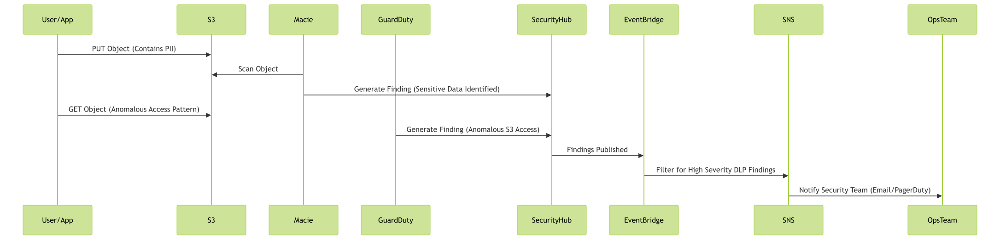


---

### **6.3 Hands-On: Macie, KMS, S3 Policies**

**1. Enable Macie and Review Findings:**
```bash
# Enable Macie (typically done via Console first)
# aws macie2 enable-macie --region us-east-1

# List sensitive data findings
aws macie2 list-findings \
    --finding-criteria '{ "criterion": { "classificationDetails.result.status.code": { "eq": ["SENSITIVE"] } } }' \
    --query 'findingIds' --region us-east-1

# Get details for a specific finding ID
aws macie2 get-findings --finding-ids <finding-id> --query 'findings[*]' --region us-east-1
```

**2. Create a KMS Customer Managed Key (CMK) for S3:**
```bash
# Create a KMS key
aws kms create-key --description "CMK for S3 Sensitive Data Bucket" --region us-east-1

# (Note the Key ARN from the output)
KEY_ARN="arn:aws:kms:us-east-1:123456789012:key/your-key-id"

# Apply a key policy (example: allow root and specific role) - modify as needed
# aws kms put-key-policy --key-id $KEY_ARN --policy-name default --policy file://kms-policy.json
```

**3. Enforce SSE-KMS Encryption using an S3 Bucket Policy:**
```json

{
  "Version": "2012-10-17",
  "Id": "EnforceSSEKMS",
  "Statement": [
    {
      "Sid": "DenyIncorrectEncryptionHeader",
      "Effect": "Deny",
      "Principal": "*",
      "Action": "s3:PutObject",
      "Resource": "arn:aws:s3:::my-sensitive-data/*",
      "Condition": {
        "StringNotEquals": {
          "s3:x-amz-server-side-encryption": "aws:kms"
        }
      }
    },
    {
      "Sid": "DenyUnencryptedObjectUploads",
      "Effect": "Deny",
      "Principal": "*",
      "Action": "s3:PutObject",
      "Resource": "arn:aws:s3:::my-sensitive-data/*",
      "Condition": {
        "Null": {
          "s3:x-amz-server-side-encryption": "true"
        }
      }
    },
    {
       "Sid": "RequireSpecificKMSKey",
       "Effect": "Deny",
       "Principal": "*",
       "Action": "s3:PutObject",
       "Resource": "arn:aws:s3:::my-sensitive-data/*",
       "Condition": {
         "StringNotLikeIfExists": {
            "s3:x-amz-server-side-encryption-aws-kms-key-id": "arn:aws:kms:us-east-1:123456789012:key/your-key-id"
          }
        }
     }
  ]
}
```

---

### **6.4 Case Study: Capital One Breach (2019)**

* **Attack:** Attacker exploited a Server-Side Request Forgery (SSRF) vulnerability in a misconfigured open-source WAF running on EC2. Used SSRF to query the EC2 metadata service, obtain temporary IAM role credentials, list accessible S3 buckets, and exfiltrate sensitive customer data (credit card applications) from misconfigured S3 buckets.
* **Failures:** WAF misconfiguration allowing SSRF; overly permissive IAM role attached to the EC2 instance running the WAF (allowed `s3:ListAllMyBuckets` and `s3:GetObject` on many buckets); inadequate S3 bucket configuration/monitoring (lack of fine-grained access control, potentially insufficient logging/alerting on large data access).
* **AWS Mitigation Strategy:**
    * **WAF Configuration (AWS WAFv2):** Implement stricter WAF rules, including specific SSRF mitigation rule sets provided by AWS. Regularly audit WAF configurations.
    * **EC2 Metadata Security (IMDSv2):** Enforce the use of Instance Metadata Service Version 2 (IMDSv2) on EC2 instances. IMDSv2 requires a session token obtained via a PUT request, making SSRF exploitation significantly harder.
        ```bash
        # Modify instance metadata options to require IMDSv2
        aws ec2 modify-instance-metadata-options \
            --instance-id i-0abcdef1234567890 \
            --http-tokens required \
            --http-endpoint enabled
        ```
    * **Least Privilege IAM Roles:** Attach IAM roles to EC2 instances with *minimal* necessary permissions. The WAF instance role should *not* have had broad S3 read access. Use tools like IAM Access Analyzer to identify and reduce excessive permissions.
    * **VPC Endpoints for S3:** Route S3 traffic from EC2 instances through a VPC Gateway Endpoint. Endpoint policies can restrict access to specific buckets or enforce conditions (e.g., only allow access from specific instance profiles).
    * **S3 Bucket Policies & Access Points:** Implement strict bucket policies denying access unless specific conditions are met (e.g., specific source VPC, specific IAM role). Use S3 Access Points with dedicated network origins and access policies for granular control. Enable S3 Block Public Access settings.
    * **Data Discovery (Macie):** Use Macie to identify sensitive data in buckets and alert on misconfigurations like public accessibility.
    * **Threat Detection (GuardDuty):** GuardDuty can detect anomalous S3 access patterns or EC2 instances querying metadata service in unusual ways.

---

## Chapter 7: Security Automation & Orchestration (SOAR) on AWS

---

### **7.1 SOAR Concepts & AWS Native Automation Services**

**SOAR (Security Orchestration, Automation, and Response):** Aims to improve Security Operations Center (SOC) efficiency by:
* **Orchestration:** Connecting disparate security tools via APIs.
* **Automation:** Executing predefined workflows (playbooks) for tasks like alert enrichment, triage, and basic containment actions.
* **Response:** Enabling faster, more consistent incident response actions.

**AWS Native Services for SOAR-like Capabilities:**
While AWS doesn't have a dedicated "SOAR" product, powerful automation can be built using event-driven services:
* **Amazon EventBridge:** A serverless event bus that connects application data from AWS services, integrated SaaS applications, and custom sources. Acts as the central hub for triggering automated workflows based on events (e.g., Security Hub findings, GuardDuty findings, CloudTrail events, Config rule changes).
* **AWS Lambda:** Serverless compute service to run code in response to triggers (like EventBridge events). Ideal for writing custom logic for enrichment (querying threat intel APIs), analysis, and executing response actions via AWS SDK calls (e.g., modifying security groups, disabling IAM keys, snapshotting instances).
* **AWS Step Functions:** Serverless function orchestrator to coordinate multiple AWS services into workflows. Useful for building complex, multi-step response playbooks involving Lambda functions, Systems Manager Automation documents, waits, and conditional logic. Visual workflow definition.
* **AWS Systems Manager (SSM) Automation:** Provides predefined or custom runbooks to safely automate common operational and security tasks across AWS resources (e.g., patching, configuration changes, collecting forensic data from EC2 instances, isolating instances). Can be invoked by Lambda or Step Functions.
* **AWS Security Hub (Custom Actions):** Allows analysts to manually trigger specific EventBridge rules (and thus downstream automation) directly from findings within the Security Hub console.

**Conceptual Automation Workflow:**


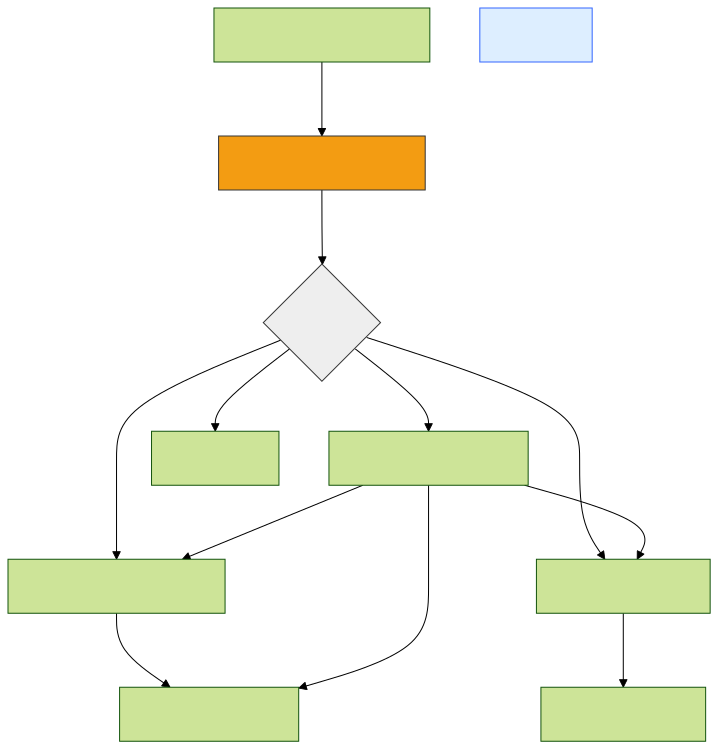


---

### **7.2 Integrating Services for Automated Response**

**Example Scenario: Auto-Isolate EC2 Instance Based on High-Severity GuardDuty Finding**

1.  **Trigger:** GuardDuty generates a high-severity finding (e.g., `Backdoor:EC2/C&CActivity.B`).
2.  **Detection:** GuardDuty sends the finding to AWS Security Hub.
3.  **Event Routing:** Security Hub publishes the finding to Amazon EventBridge (default event bus).
4.  **Filtering:** An EventBridge rule is configured to match specific finding types (e.g., `GuardDuty Finding`) and severity levels (e.g., `HIGH`, `CRITICAL`) and potentially specific finding `Type` patterns.
5.  **Action (Lambda):** The EventBridge rule triggers an AWS Lambda function.
6.  **Processing:** The Lambda function parses the event data to extract details like the affected EC2 instance ID and finding information.
7.  **Enrichment (Optional):** Lambda could query threat intelligence feeds or internal asset databases for more context.
8.  **Response Action:** Lambda uses the AWS SDK (EC2 API) to:
    * Identify the current Security Groups attached to the instance.
    * Remove existing Security Groups (except perhaps a basic management SG).
    * Attach a pre-defined "Quarantine" Security Group that blocks all inbound/outbound traffic except for specific SOC/forensic access ports/IPs.
9.  **Notification/Logging:** Lambda sends a notification (e.g., via SNS to Slack/email) and logs its actions to CloudWatch Logs. It could also update the Security Hub finding notes or workflow status.

**Alternative Action (SSM Automation):** Instead of Lambda directly calling EC2 APIs, EventBridge could trigger an SSM Automation document that performs the instance isolation steps, potentially offering more robust error handling and pre-built actions.

**Key IAM Permissions Needed for Lambda/SSM Role:**
* `ec2:DescribeInstances`, `ec2:DescribeSecurityGroups`
* `ec2:ModifyInstanceAttribute` (to change SGs) or `ec2:AuthorizeSecurityGroupIngress/Egress`, `ec2:RevokeSecurityGroupIngress/Egress` (less common for quarantine)
* `securityhub:BatchUpdateFindings` (to update notes/status)
* `ssm:StartAutomationExecution` (if triggering SSM)
* Permissions to publish to SNS, write to CloudWatch Logs.

---

### **7.3 Hands-On: EventBridge Rule to Trigger Lambda**

**Scenario:** Trigger a Lambda function when Security Hub imports a finding with severity `HIGH` or `CRITICAL`.

**1. Create a Lambda Function (Python Example - Placeholder Logic):**
   * Create a basic Python Lambda function (e.g., `SecurityHubResponder`) in the AWS Console or via SAM/CDK.
   * Ensure its execution role has necessary permissions (e.g., `securityhub:BatchUpdateFindings`, `ec2:DescribeInstances`, `ec2:ModifyInstanceAttribute`, `logs:CreateLogGroup`, `logs:CreateLogStream`, `logs:PutLogEvents`).
   * Example Python Code (`lambda_function.py`):
     ```python
     import json
     import boto3
     import os
     import datetime

     print('Loading function')
     securityhub = boto3.client('securityhub')
     ec2 = boto3.client('ec2')
     # Assume Quarantine SG ID is stored in Environment Variable
     QUARANTINE_SG_ID = os.environ.get('QUARANTINE_SG_ID', 'sg-xxxxxxxxxxxxxxxxx') # Replace with your actual SG ID or get from env

     def lambda_handler(event, context):
         print("Received event: " + json.dumps(event, indent=2))

         try:
             # Extract findings from the event (Security Hub findings via EventBridge)
             findings = event.get('detail', {}).get('findings', [])
             processed_findings = []

             for finding in findings:
                 finding_id = finding['Id']
                 product_arn = finding['ProductArn']
                 finding_severity_label = finding.get('Severity', {}).get('Label', 'INFORMATIONAL').upper()
                 instance_id = None

                 # Extract Instance ID if available in resources
                 for resource in finding.get('Resources', []):
                     if resource.get('Type') == 'AwsEc2Instance':
                         instance_id = resource.get('Id').split('/')[-1] # Get instance ID part
                         break

                 print(f"Processing Finding: {finding_id}, Severity: {finding_severity_label}, Instance: {instance_id}")

                 # --- Simple Response Logic ---
                 if instance_id and finding_severity_label in ['HIGH', 'CRITICAL']:
                     print(f"High/Critical severity finding for instance {instance_id}. Attempting quarantine.")
                     try:
                         # Describe instance to get current SGs (optional, could just overwrite)
                         # response = ec2.describe_instances(InstanceIds=[instance_id])
                         # current_groups = [sg['GroupId'] for sg in response['Reservations'][0]['Instances'][0]['SecurityGroups']]
                         # print(f"Current SGs for {instance_id}: {current_groups}")

                         # Apply quarantine SG - Replaces all existing SGs
                         ec2.modify_instance_attribute(
                             InstanceId=instance_id,
                             Groups=[QUARANTINE_SG_ID]
                         )
                         print(f"Successfully applied Quarantine SG {QUARANTINE_SG_ID} to instance {instance_id}")
                         notes = f"Automated Action: Instance quarantined due to finding {finding_id}."

                     except Exception as e:
                         print(f"ERROR applying quarantine SG to {instance_id}: {str(e)}")
                         notes = f"Automated Action FAILED: Quarantine failed for finding {finding_id}. Error: {str(e)}"

                     # Update finding notes in Security Hub
                     securityhub.batch_update_findings(
                         FindingIdentifiers=[{'Id': finding_id, 'ProductArn': product_arn}],
                         Note={'Text': notes, 'UpdatedBy': context.function_name},
                         Severity={'Label': finding_severity_label} # Keep original severity or adjust?
                     )
                     processed_findings.append(finding_id)

                 else:
                     print(f"Skipping response for finding {finding_id} (No instance ID or low severity)")


             return {
                 'statusCode': 200,
                 'body': json.dumps(f'Processed {len(processed_findings)} findings.')
             }

         except Exception as e:
             print(f"Unhandled ERROR: {str(e)}")
             raise e
     ```

**2. Create an EventBridge Rule:**
```bash
# Create an EventBridge rule matching specific Security Hub findings
aws events put-rule \
    --name "RespondToCriticalSecurityHubFindings" \
    --event-pattern '{
      "source": ["aws.securityhub"],
      "detail-type": ["Security Hub Findings - Imported"],
      "detail": {
        "findings": {
          "Compliance.Status": ["FAILED", "WARNING"],
          "RecordState": ["ACTIVE"],
          "Workflow.Status": ["NEW"],
          "Severity.Label": ["HIGH", "CRITICAL"]
        }
      }
    }' \
    --state ENABLED \
    --description "Rule to trigger Lambda for critical/high severity Security Hub findings"

# Add the Lambda function as a target for the rule
aws events put-targets \
    --rule "RespondToCriticalSecurityHubFindings" \
    --targets '[{
        "Id": "1",
        "Arn": "arn:aws:lambda:us-east-1:123456789012:function:SecurityHubResponder" # Replace with your Lambda ARN
      }]'

# Add permissions for EventBridge to invoke the Lambda function
aws lambda add-permission \
    --function-name SecurityHubResponder \
    --statement-id EventBridgeInvokePermission-SecurityHub \
    --action 'lambda:InvokeFunction' \
    --principal events.amazonaws.com \
    --source-arn arn:aws:events:us-east-1:123456789012:rule/RespondToCriticalSecurityHubFindings # Replace with your Rule ARN
```
*(Ensure Lambda function name, ARNs, region, and Quarantine SG ID are correct)*

---

### **7.4 Case Study: Automated Response to Credential Compromise**

* **Scenario:** GuardDuty detects `UnauthorizedAccess:IAMUser/MaliciousIPCaller` or `CredentialAccess:IAMUser/AnomalousBehavior` indicating potential IAM user credential compromise.
* **Goal:** Automatically disable the compromised IAM user's access keys and console password to prevent further malicious activity, while notifying security.
* **Automated Workflow (EventBridge -> Step Functions -> Lambda):**
    1.  **Trigger:** GuardDuty finding sent to Security Hub, then to EventBridge.
    2.  **EventBridge Rule:** Matches the specific GuardDuty finding types related to IAM user compromise.
    3.  **Target (Step Functions):** Triggers an AWS Step Functions state machine designed for IAM credential response.
    4.  **Step Functions Workflow:**
        * **Parse Input:** Extract compromised IAM User ARN/Name and finding details.
        * **Get User Details (Lambda):** Call Lambda function A to get current access keys (`list-access-keys`) and check console login profile status (`get-login-profile`) for the user.
        * **Disable Access Keys (Lambda):** Call Lambda function B to iterate through active access keys found and set their status to `Inactive` (`update-access-key`).
        * **Disable Console Password (Lambda):** Call Lambda function C to delete the user's login profile (`delete-login-profile`), preventing console login.
        * **Update Security Hub Finding (Lambda):** Call Lambda function D to add notes to the finding indicating actions taken.
        * **Notify SOC (SNS Task):** Publish a message to an SNS topic alerting the SOC.
        * **Error Handling:** Include `Catch` blocks for failures in Lambda functions (e.g., permissions errors) and route to a failure notification step.
* **Benefits:** Rapid containment (seconds/minutes) significantly reduces the window for an attacker to use compromised credentials. Consistent, documented response actions. Reduces manual SOC effort.
* **Considerations:** Ensure the Lambda execution roles have the necessary `iam:UpdateAccessKey`, `iam:DeleteLoginProfile`, `iam:ListAccessKeys`, `iam:GetLoginProfile` permissions (use with extreme caution - least privilege essential). Thorough testing in a non-production environment is critical. Consider edge cases (e.g., user doesn't have console password).

---

## Chapter 8: Compliance, Governance & Future Trends on AWS

---

### **8.1 Achieving Compliance on AWS**

**Shared Responsibility Model:** AWS is responsible for the security *of* the cloud (infrastructure, hardware, managed services); the customer is responsible for security *in* the cloud (data, applications, OS patching, network config, IAM). Compliance requires managing responsibilities in both domains.

**AWS Compliance Programs:** AWS undergoes regular independent audits for various global and regional compliance standards (e.g., SOC 1/2/3, ISO 27001, PCI DSS Level 1, HIPAA, FedRAMP). Customers inherit AWS's infrastructure compliance, but must implement controls for their own environment.
* **AWS Artifact:** Provides on-demand access to AWS's security and compliance reports (e.g., SOC reports, PCI Attestation of Compliance) and select online agreements. Used for providing evidence to auditors.

**Services for Managing Compliance:**
* **AWS Config:** Continuously monitors and records AWS resource configurations. Allows assessment against desired configurations using Config Rules (managed and custom). Provides history for auditing. Essential for tracking configuration compliance (e.g., "Is S3 encryption enabled?", "Are specific ports open in Security Groups?").
* **AWS Security Hub:** Aggregates findings and runs automated, continuous checks against security best practices and compliance standards (e.g., AWS Foundational Security Best Practices, CIS AWS Foundations Benchmark, PCI DSS, NIST). Provides compliance scores and identifies failing controls.
* **AWS Audit Manager:** Helps continuously audit AWS usage to simplify risk assessment and compliance with regulations/standards. Automates evidence collection from CloudTrail, Config, Security Hub, etc., mapping it to specific control requirements (e.g., PCI DSS controls). Streamlines audit preparation.
* **Service Catalog:** Define and govern approved IT services (e.g., standardized EC2 AMIs, RDS configurations) that meet compliance requirements, preventing deployment of non-compliant resources.

**Mapping Controls (Example: PCI DSS):**


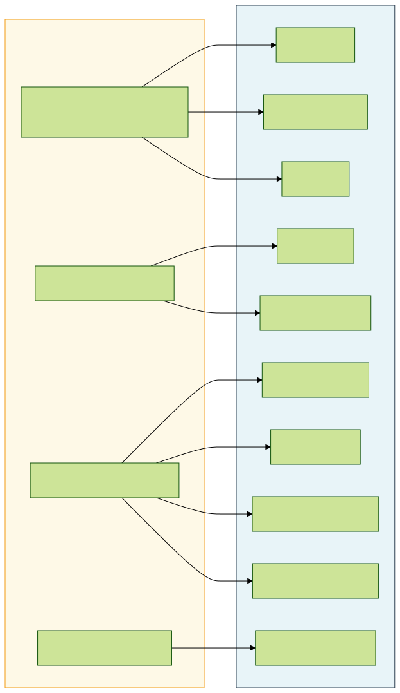


---

### **8.2 Governance at Scale**

**Challenges:** Managing security, compliance, and costs consistently across multiple AWS accounts and complex environments.

**AWS Services for Multi-Account Governance:**
* **AWS Organizations:** Centrally manage and govern your environment as you grow and scale AWS resources.
    * **Organizational Units (OUs):** Group accounts based on function, environment (Prod/Dev/Test), or compliance scope.
    * **Service Control Policies (SCPs):** Centrally control the maximum available permissions for IAM users and roles in member accounts. Act as guardrails, *not* grant permissions. Can enforce preventative controls (e.g., deny ability to disable GuardDuty, restrict service usage to specific regions).
* **AWS Control Tower:** Automates the setup of a secure, multi-account AWS environment (landing zone) based on best practices. Provisions core accounts (Management, Log Archive, Audit), sets up OUs, applies preventative and detective guardrails (using SCPs, Config Rules, etc.), establishes centralized logging (CloudTrail, Config). Simplifies landing zone setup and ongoing governance.
* **AWS Security Hub (Multi-Account):** Designate an administrator account to aggregate findings and compliance status from member accounts across an organization. Provides a single pane of glass for security posture across the entire AWS Organization.
* **Amazon GuardDuty (Multi-Account):** Similar aggregation model as Security Hub for threat detection findings.
* **AWS Config (Aggregator):** Collect configuration and compliance data from multiple accounts and regions into a single aggregator account.
* **AWS IAM Identity Center (Successor to AWS SSO):** Centrally manage workforce access to multiple AWS accounts and business applications using your existing identity provider (e.g., Azure AD, Okta) or its built-in identity store. Simplifies user access management.

**Conceptual Control Tower Environment:**


---

### **8.3 Future Trends & Considerations**

**Evolving Security Landscape on AWS:**
* **Post-Quantum Cryptography (PQC):** Quantum computers pose a threat to current public-key cryptography (RSA, ECC). AWS is actively researching and planning migration to PQC algorithms.
    * **Impact:** Affects TLS, digital signatures, KMS asymmetric keys.
    * **AWS Actions:** Participating in NIST PQC standardization; introducing hybrid schemes (classical + PQC) for TLS in some services (e.g., KMS, IoT Core); planning future support in ACM, IAM, etc. Customers need to plan for future application/protocol updates.
* **AI/ML Security:** Securing AI/ML workloads (e.g., on Amazon SageMaker) and using AI/ML for security.
    * **Securing ML:** Protecting training data integrity, preventing model theft/poisoning, securing SageMaker environments (Network Isolation, IAM roles, Endpoint policies).
    * **AI for Security:** Enhanced threat detection (GuardDuty, Macie), automated analysis (Detective), potential for AI-driven response generation (research phase). Requires vigilance against adversarial AI targeting security tools.
* **Confidential Computing:** Protecting data *while it is being processed* in memory.
    * **AWS Nitro Enclaves:** Create isolated compute environments within EC2 instances using the Nitro Hypervisor. Provides cryptographic attestation of the enclave's identity and isolation, suitable for processing highly sensitive data (e.g., PII processing, cryptographic operations) with reduced trust in the host OS or instance administrators.
* **Serverless Security:** Unique challenges for Lambda, Fargate, API Gateway (event injection, function permissions, dependency vulnerabilities). Requires specific security approaches (IAM execution roles, API Gateway authorizers, function code scanning, dependency management).
* **Shift Left Security / DevSecOps:** Integrating security earlier in the development lifecycle using Infrastructure as Code (IaC) scanning (e.g., `cfn-lint`, `tfsec`, Checkov), CI/CD pipeline security checks (SAST, DAST, SCA), and GitOps principles. Services like AWS CodePipeline, CodeBuild, CodeDeploy facilitate this.

**Key Takeaway:** The cloud security landscape is constantly evolving. Architectures must be adaptable, leveraging new AWS security services and features while anticipating emerging threats and technological shifts like PQC and AI security. Continuous learning and adaptation are essential.

---

### **8.4 Hands-On: AWS Config Rules & Organizations SCPs**

**1. Deploy an AWS Config Managed Rule (e.g., Check for Public S3 Buckets):**
```bash
# Deploy the 's3-bucket-public-read-prohibited' managed rule
aws configservice put-config-rule \
    --config-rule '{
        "ConfigRuleName": "s3-bucket-public-read-prohibited",
        "Description": "Checks that S3 buckets do not allow public read access.",
        "Scope": {
            "ComplianceResourceTypes": [
                "AWS::S3::Bucket"
            ]
        },
        "Source": {
            "Owner": "AWS",
            "SourceIdentifier": "S3_BUCKET_PUBLIC_READ_PROHIBITED"
        }
    }'

# Check compliance details for the rule
aws configservice get-compliance-details-by-config-rule \
    --config-rule-name s3-bucket-public-read-prohibited \
    --query 'EvaluationResults[*].{ResourceId:EvaluationResultIdentifier.EvaluationResultQualifier.ResourceId, Compliance:ComplianceType, Time:ResultRecordedTime}' \
    --output table
```

**2. Create a Service Control Policy (SCP) to Deny Ability to Leave Organization:**
```json
# SCP JSON Document (prevent-member-leave.json)
{
  "Version": "2012-10-17",
  "Statement": [
    {
      "Sid": "PreventLeavingOrganization",
      "Effect": "Deny",
      "Action": [
        "organizations:LeaveOrganization"
      ],
      "Resource": "*"
      # Optionally add a condition to exempt specific roles/users if needed
      # "Condition": {
      #   "StringNotLike": {
      #     "aws:PrincipalARN": [
      #       "arn:aws:iam::*:role/OrganizationAccountAccessRole"
      #     ]
      #   }
      # }
    }
  ]
}
```
```bash
# Ensure Organizations policy type 'SERVICE_CONTROL_POLICY' is enabled at the root
# aws organizations enable-policy-type --root-id r-xxxx --policy-type SERVICE_CONTROL_POLICY

# Create the SCP
aws organizations create-policy \
    --content file://prevent-member-leave.json \
    --description "Prevents member accounts from leaving the organization" \
    --name "PreventMemberAccountLeave" \
    --type "SERVICE_CONTROL_POLICY"

# (Note the Policy ID from the output)
POLICY_ID="p-xxxxxxxx"

# Attach the SCP to the Organization Root or a specific OU
# Attaching to Root applies to all accounts except management account
aws organizations attach-policy \
    --policy-id $POLICY_ID \
    --target-id r-xxxx # Replace with your Root ID or an OU ID (ou-xxxx-yyyyyyy)
```
*(Caution: Test SCPs carefully, they can block legitimate actions if not written correctly. Denying `organizations:LeaveOrganization` is a common security guardrail.)*

---

## Chapter 9: Incident Response & Forensics on AWS

---

### **9.1 Incident Response Lifecycle on AWS**

**Adapting Traditional IR Phases to the Cloud:** The standard IR lifecycle (Preparation, Identification, Containment, Eradication, Recovery, Post-Incident Activity) applies, but implementation details differ on AWS due to the dynamic, API-driven nature of the cloud.

* **Preparation:**
    * **IAM:** Pre-define dedicated IAM roles for IR teams with necessary permissions (e.g., `ReadOnlyAccess`, specific EC2 snapshot/describe permissions, GuardDuty/Security Hub access, SSM permissions, S3 access for evidence). Use IAM Identity Center for access.
    * **Logging:** Ensure comprehensive logging is enabled and centralized: CloudTrail (all regions, management events, data events for critical services like S3), VPC Flow Logs, DNS Logs, Load Balancer Logs, Config Logs, Security Hub findings, GuardDuty findings. Store logs securely and immutably (e.g., S3 bucket with object lock in a dedicated Log Archive account).
    * **Tooling:** Deploy/configure security services (GuardDuty, Security Hub, Inspector, Macie, Network Firewall). Prepare forensic tools/AMIs if needed. Have IR playbooks defined (potentially in Step Functions/SSM Automation).
    * **Snapshots/Backups:** Ensure regular, automated EBS snapshots and RDS backups are configured for critical systems. Test restore procedures.
    * **Network Access:** Define methods for secure forensic access (e.g., dedicated bastion host VPC, specific Security Groups).
* **Identification:**
    * **Alerting:** Primarily driven by GuardDuty, Security Hub (native + integrated partner findings), Config Rules, CloudWatch Alarms (performance anomalies, specific log metrics).
    * **Initial Triage:** Use Security Hub and Detective to quickly correlate findings, understand scope, and prioritize alerts.
* **Containment:** Leverage AWS APIs for rapid action.
    * **Network:** Modify Security Groups/NACLs, update Network Firewall rules, change Route 53 records, isolate subnets via TGW route tables.
    * **Compute:** Stop/Terminate EC2 instances, revoke EC2 IAM role credentials, use SSM Agent to disable network interfaces or run containment scripts. Isolate Lambda functions (e.g., reserve concurrency = 0, modify VPC config). Isolate containers (e.g., remove from service discovery, kill pod).
    * **Identity:** Disable IAM user access keys/passwords, revoke temporary credentials (role sessions), update IAM policies/SCPs.
    * **Data:** Modify S3 bucket policies/ACLs, rotate KMS keys (use with caution), snapshot databases/volumes.
* **Eradication:** Remove malware/attacker persistence. Often involves terminating compromised resources and redeploying from a known-good state (golden AMI, IaC template). Use Inspector/EDR scans on snapshots/rebuilt instances. Fix the root cause vulnerability/misconfiguration.
* **Recovery:** Restore services from backups/snapshots or redeploy via IaC. Validate functionality and security posture before returning to production. Monitor closely.
* **Post-Incident Activity (Lessons Learned):** Analyze CloudTrail logs, GuardDuty findings, Detective graphs, forensic evidence (snapshots). Update IR plans, playbooks, detection rules, preventative controls (IAM policies, SGs, Config rules, SCPs). Share findings (appropriately).

**Shared Responsibility in IR:** AWS secures the underlying infrastructure. Customers are responsible for responding to incidents involving their data, applications, OS, IAM configurations, and network settings within their VPCs. AWS Support (potentially Enterprise Support with Infrastructure Event Management - IEM) can assist with AWS service issues or provide guidance.

---

### **9.2 AWS Services for IR & Forensics**

**Key Services:**
* **AWS CloudTrail:** Audit trail of almost all AWS API calls. Essential for understanding *who* did *what*, *when*, and *from where*. Use Athena or CloudTrail Lake to query logs effectively during investigations.
* **AWS Config:** Records resource configuration changes over time. Crucial for identifying unauthorized configuration modifications (e.g., Security Group changes, public S3 buckets, IAM policy changes) that may indicate compromise or be the root cause.
* **VPC Flow Logs:** Captures IP traffic information going to/from network interfaces in your VPC. Analyze for C2 communication, lateral movement attempts, data exfiltration patterns, scanning activity. Use Athena or Traffic Mirroring + analysis tools.
* **Amazon GuardDuty:** Provides managed threat detection based on logs, network flows, and ML. Often the primary *identification* source. Findings provide context for investigation.
* **AWS Security Hub:** Centralizes findings from GuardDuty and other services, provides context, tracks status, and triggers response workflows via EventBridge.
* **Amazon Detective:** Automates log analysis (CloudTrail, VPC Flow, GuardDuty) to build behavioral graphs and visualize incident scope and root cause, significantly reducing manual investigation time.
* **AWS Systems Manager (SSM):**
    * **Run Command/Session Manager:** Securely access instances for live analysis or to deploy forensic tools *without* opening SSH/RDP ports.
    * **Inventory/State Manager:** Collect detailed information about instance configurations and software.
* **Amazon EBS Snapshots:** Create point-in-time snapshots of EBS volumes attached to potentially compromised EC2 instances for offline forensic analysis without altering the original evidence.
* **Amazon S3:** Secure storage for logs (using Log Archive account pattern), forensic disk images (snapshots copied), and case evidence. Use Bucket Policies, Object Lock, and encryption.
* **AWS Lambda & Step Functions:** Automate containment and enrichment tasks within IR playbooks.

**Forensic Challenges in the Cloud:**
* **Ephemeral Resources:** Instances, containers, functions may be terminated before analysis. Requires rapid evidence acquisition (logging, snapshots).
* **Lack of Physical Access:** Cannot physically seize hardware. Relies entirely on APIs and logs provided by AWS.
* **Abstraction:** Hypervisor and underlying infrastructure are managed by AWS, limiting low-level hardware forensics. Focus shifts to OS/application/API log analysis.
* **Data Volume:** Cloud environments generate vast amounts of log data. Requires scalable analysis tools (Athena, OpenSearch, Detective).
* **Shared Infrastructure:** Need to clearly distinguish customer activity from AWS infrastructure activity (via logs and service understanding).

---

### **9.3 Hands-On: IR Actions (Isolate, Snapshot, Query Logs)**

**1. Isolate a Potentially Compromised EC2 Instance:**
```bash
INSTANCE_ID="i-0abcdef1234567890"
QUARANTINE_SG="sg-quarantine12345" # Pre-defined SG blocking most traffic
REGION="us-east-1"

# Get current security groups (Optional - for potential restoration later)
# CURRENT_SGS=$(aws ec2 describe-instances --instance-ids $INSTANCE_ID --query "Reservations[].Instances[].SecurityGroups[].GroupId" --output text --region $REGION)
# echo "Current SGs: $CURRENT_SGS"

echo "Applying Quarantine Security Group $QUARANTINE_SG to instance $INSTANCE_ID..."
aws ec2 modify-instance-attribute --instance-id $INSTANCE_ID --groups $QUARANTINE_SG --region $REGION

echo "Instance $INSTANCE_ID network isolation attempted."

# Alternative using SSM to run local firewall commands (if SSM Agent installed & role permits)
# aws ssm send-command --instance-ids $INSTANCE_ID --document-name "AWS-RunShellScript" \
#  --parameters 'commands=["sudo iptables -P INPUT DROP", "sudo iptables -P OUTPUT DROP", "sudo iptables -A INPUT -s <Your_Forensic_IP>/32 -j ACCEPT", "...allow specific management ports..."]' \
#  --comment "Isolating instance via host firewall for IR" --region $REGION
```

**2. Create EBS Snapshot for Forensic Analysis:**
```bash
INSTANCE_ID="i-0abcdef1234567890"
REGION="us-east-1"

echo "Finding root volume for instance $INSTANCE_ID..."
ROOT_VOLUME_ID=$(aws ec2 describe-instances --instance-ids $INSTANCE_ID --query "Reservations[].Instances[].BlockDeviceMappings[?DeviceName=='/dev/sda1' || DeviceName=='/dev/xvda'].Ebs.VolumeId" --output text --region $REGION)
# Adjust DeviceName if needed based on AMI

if [ -z "$ROOT_VOLUME_ID" ]; then
  echo "ERROR: Could not find root volume ID for $INSTANCE_ID."
  exit 1
fi
echo "Found root volume: $ROOT_VOLUME_ID"

echo "Creating snapshot of volume $ROOT_VOLUME_ID..."
SNAPSHOT_INFO=$(aws ec2 create-snapshot --volume-id $ROOT_VOLUME_ID --description "Forensic snapshot for instance $INSTANCE_ID during IR-Case-XYZ" --tag-specifications 'ResourceType=snapshot,Tags=[{Key=CaseID,Value=IR-Case-XYZ},{Key=InstanceID,Value='$INSTANCE_ID'}]' --region $REGION)

SNAPSHOT_ID=$(echo $SNAPSHOT_INFO | jq -r '.SnapshotId')
echo "Snapshot creation initiated: $SNAPSHOT_ID"
echo "Use 'aws ec2 describe-snapshots --snapshot-ids $SNAPSHOT_ID' to monitor status."
```

**3. Query CloudTrail Logs with Athena for Suspicious IAM Activity:**
```sql
-- Pre-requisite: CloudTrail Lake Event Data Store or Athena table created over CloudTrail logs in S3

-- Example Athena Query: Find API calls made by a potentially compromised user in the last 24 hours
SELECT
    eventTime,
    eventSource,
    eventName,
    sourceIPAddress,
    userAgent,
    requestParameters,
    responseElements,
    errorCode,
    errorMessage
FROM
    "my_cloudtrail_database"."my_cloudtrail_table" -- Replace with your DB/Table names
WHERE
    userIdentity.arn = 'arn:aws:iam::123456789012:user/CompromisedUser'
    AND eventTime >= format_datetime(current_timestamp - interval '24' hour, 'yyyy-MM-dd''T''HH:mm:ss''Z')
ORDER BY
    eventTime DESC;

-- Find potentially suspicious console logins without MFA
SELECT
    eventTime,
    sourceIPAddress,
    userIdentity.userName,
    additionalEventData.MFAUsed
FROM
    "my_cloudtrail_database"."my_cloudtrail_table"
WHERE
    eventName = 'ConsoleLogin'
    AND eventTime >= format_datetime(current_timestamp - interval '7' day, 'yyyy-MM-dd''T''HH:mm:ss''Z')
    AND additionalEventData.MFAUsed != 'Yes' -- Can be 'No' or null
ORDER BY
    eventTime DESC;
```

---

### **9.4 Case Study: Responding to Crypto-Mining Attack**

* **Scenario:** GuardDuty finding `CryptoCurrency:EC2/BitcoinTool.B!DNS` is generated for an EC2 instance, indicating communication with crypto-mining pools. CPU utilization alarms may also trigger in CloudWatch.
* **IR Workflow:**
    1.  **Identification (Triage):** SOC analyst receives GuardDuty alert via Security Hub/SNS. Confirms finding details (instance ID, involved domains, severity HIGH). Correlates with any CloudWatch CPU alarms. Determines instance owner/purpose via tags or CMDB. (Time: Minutes)
    2.  **Containment (Automated/Manual):**
        * *Automated Option:* Pre-built Lambda/Step Function workflow (triggered by EventBridge rule for this finding type) automatically applies "Quarantine" SG to the instance `i-crypto`. (Time: < 1 minute)
        * *Manual Option:* Analyst uses AWS Console or CLI (like example 9.3.1) to apply the Quarantine SG. (Time: Minutes)
    3.  **Evidence Preservation (Manual/Semi-Automated):**
        * Analyst initiates EBS snapshot of the root volume of `i-crypto` using CLI (like example 9.3.2) or Console. Tags snapshot with IR case ID. (Time: Minutes to initiate)
        * Analyst uses SSM Run Command to attempt collection of volatile data (running processes, network connections, memory image if tools/permissions allow) *before* stopping/terminating, saving output to an S3 bucket. (Time: Minutes)
    4.  **Investigation (Manual):**
        * Analyst uses Detective, starting from the GuardDuty finding, to explore related network connections (VPC Flow Logs), API calls (CloudTrail) around the time of the finding to look for the initial compromise vector (e.g., unusual SSH login, web vulnerability exploit).
        * Analyst reviews CloudTrail logs directly (via Athena or Console) for suspicious `RunInstances`, `CreateUser`, `PutUserPolicy` calls preceding the incident.
        * Forensic team attaches the EBS snapshot to a secure forensic analysis instance (in an isolated VPC) to examine filesystem, logs, malware binaries.
    5.  **Eradication:**
        * Based on investigation, fix the root cause (patch vulnerability, strengthen credentials, fix misconfiguration).
        * Terminate the compromised instance `i-crypto`.
    6.  **Recovery:** Redeploy the application/service using a known-good AMI/IaC template incorporating the fix.
    7.  **Post-Mortem:** Document findings, update playbooks, tune detection rules (e.g., add mining pool IPs to Network Firewall blocklist), conduct lessons learned session. (Time: Hours/Days)

---

## Chapter 10: DevSecOps & Security as Code on AWS

---

### **10.1 DevSecOps Principles & CI/CD Pipeline Security**

**DevSecOps:** An extension of DevOps principles that integrates security practices seamlessly into the entire software development lifecycle (SDLC), from planning and coding through testing, deployment, and operations. Aims to make security a shared responsibility, automating security checks early and often ("Shift Left").

**Core Principles:**
* **Security as Code:** Define security controls, policies, and tests in code alongside application and infrastructure code (e.g., IAM policies in Terraform, security tests in pipeline scripts).
* **Automation:** Automate security scanning, testing, policy enforcement, and compliance checks within the CI/CD pipeline.
* **Collaboration:** Break down silos between Development, Security, and Operations teams.
* **Threat Modeling:** Proactively identify threats during design/planning phases.
* **Continuous Monitoring & Feedback:** Monitor applications and infrastructure in production, feeding security insights back into the development cycle.
* **Immutable Infrastructure:** Treat infrastructure components (servers, containers) as disposable; replace rather than patch in place where possible.

**Securing the CI/CD Pipeline on AWS:**
The pipeline itself (e.g., using AWS CodeCommit, CodeBuild, CodeDeploy, CodePipeline) is critical infrastructure and needs protection:
* **IAM Permissions:** Apply least privilege IAM roles to pipeline stages (e.g., CodeBuild service role should only have permissions needed for build/test/push, not broad production access). Use conditions to restrict access further.
* **Secrets Management:** Store sensitive credentials (API keys, tokens, passwords) needed by the pipeline securely in AWS Secrets Manager or SSM Parameter Store (SecureString), not in source code or environment variables. Grant pipeline roles minimal permission to retrieve specific secrets.
* **Network Security:** Run CodeBuild jobs within a specific VPC (if needed to access internal resources) with appropriate Security Group rules. Limit outbound network access.
* **Artifact Security:** Store build artifacts securely (e.g., S3 buckets with encryption, access logging, versioning). Sign artifacts (e.g., container images using Docker Content Trust/Notary, code signing for binaries) and verify signatures during deployment.
* **Third-Party Integrations:** Securely manage access keys/tokens for third-party tools integrated into the pipeline (scanners, artifactories).

**Typical DevSecOps Pipeline Stages on AWS:**


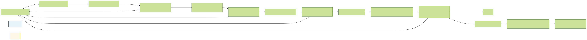


---

### **10.2 Security *as Code* on AWS**

**Concept:** Managing and automating security configurations and policies using code definition files stored in version control, enabling repeatable, testable, and auditable security deployments.

**Key Areas:**
* **Infrastructure as Code (IaC) Security:** Defining AWS infrastructure (VPCs, EC2, S3, IAM Roles, etc.) using CloudFormation, Terraform, CDK, etc.
    * **Scanning IaC Templates:** Integrate static analysis tools into CI/CD pipelines or developer workflows to check for misconfigurations *before* deployment.
        * **Tools:** `cfn-lint` (CloudFormation linting), `cfn-guard` (policy-as-code checks for CFN), Checkov, `tfsec`/`tflint` (Terraform), Terrascan, KICS.
    * **Best Practices:** Use parameterized templates, avoid hardcoded secrets, define secure defaults (e.g., enable encryption), apply least privilege IAM roles within templates.
* **Policy as Code:** Defining security policies (IAM, SCPs, WAF rules, Network Firewall rules, Security Hub controls) in a codified, version-controlled format.
    * **Tools/Formats:** IAM policy JSON, SCP JSON, AWS Config RDK/CDK for custom Config rules, Open Policy Agent (OPA) with Rego language (can be used for various policy decisions).
    * **Benefits:** Consistency, peer review, automated testing of policies, easier auditing.
* **Compliance as Code:** Defining compliance requirements and checks as code.
    * **Tools:** AWS Config managed and custom rules (deployable via CloudFormation/CDK), Security Hub standards checks, AWS Audit Manager automated evidence collection mapped to controls. Allows continuous compliance monitoring and automated reporting.
* **Security Testing as Code:** Writing automated security tests (unit tests for security logic, integration tests for controls, DAST scans) that run as part of the CI/CD pipeline.
    * **Tools:** OWASP ZAP, Selenium/Cypress for DAST; standard unit test frameworks for security libraries.
* **Secrets Management:** Securely injecting secrets into applications and infrastructure at runtime, managed via code/APIs rather than manual configuration.
    * **AWS Services:** AWS Secrets Manager, AWS Systems Manager Parameter Store (SecureString type). Applications/IaC retrieve secrets using IAM permissions at runtime.

**Benefits of Security as Code:**
* **Consistency & Repeatability:** Ensures security settings are applied uniformly across environments.
* **Auditability:** Changes are tracked in version control (Git).
* **Automation:** Enables automated testing and deployment of security controls.
* **Collaboration:** Allows security requirements to be reviewed and managed alongside application/infrastructure code.
* **Scalability:** Easier to manage security configurations for large, complex environments.

---

### **10.3 Hands-On: IaC Scanning & Secrets Management**

**1. Scan CloudFormation Template with `cfn-lint`:**
```bash
# Install cfn-lint (if not already installed)
# pip install cfn-lint

# Assume template.yaml contains a CloudFormation stack definition
# Example: Check for common issues like unencrypted S3 buckets, overly permissive SGs

# Run the linter
cfn-lint template.yaml

# Example Output (if issues found):
# E3002 Invalid Property Resources/MyS3Bucket/Properties/BucketEncryption/ServerSideEncryptionConfiguration/0/ServerSideEncryptionByDefault/SSEAlgorithm should be AES256 or aws:kms
# W2001 Parameter UnusedParameter not used.
# ...

# Integrate this into a CodeBuild buildspec.yml file:
# version: 0.2
# phases:
#   install:
#     runtime-versions:
#       python: 3.11
#     commands:
#       - pip install cfn-lint
#   build:
#     commands:
#       - echo "Linting CloudFormation template..."
#       - cfn-lint template.yaml
```

**2. Scan Terraform Code with `tfsec` or Checkov:**
```bash
# Install tfsec or checkov (examples)
# brew install tfsec
# pip install checkov

# Navigate to your Terraform project directory containing .tf files

# Run tfsec
tfsec .

# Run checkov
checkov -d .

# Example Output (showing potential issues):
# Result: FAIL
# ID: AWS017
# Type: Security Group Rule Allows All Traffic
# Message: Security group rule allows ingress from public internet.
# File: main.tf Line: 25

# Integrate into CI/CD pipeline (e.g., GitHub Actions, CodeBuild)
```

**3. Retrieve a Secret from AWS Secrets Manager in Python (Lambda/EC2):**
```python
import boto3
import json
import os

# Secret Name stored in environment variable or config
secret_name = os.environ.get("DATABASE_SECRET_NAME", "prod/mywebapp/database/credentials")
region_name = os.environ.get("AWS_REGION", "us-east-1")

# Create a Secrets Manager client
session = boto3.session.Session()
client = session.client(service_name='secretsmanager', region_name=region_name)

def get_secret(secret_name):
    """Retrieves secret value from AWS Secrets Manager"""
    try:
        get_secret_value_response = client.get_secret_value(SecretId=secret_name)
    except Exception as e:
        print(f"ERROR: Could not retrieve secret '{secret_name}': {str(e)}")
        raise e
    else:
        # Decrypts secret using the associated KMS key - client does this automatically
        if 'SecretString' in get_secret_value_response:
            secret = get_secret_value_response['SecretString']
            return json.loads(secret) # Assuming secret stored as JSON key-value pairs
        else:
            # Handle binary secrets if necessary
            decoded_binary_secret = base64.b64decode(get_secret_value_response['SecretBinary'])
            return decoded_binary_secret # Or process as needed

# --- Usage Example ---
try:
    db_credentials = get_secret(secret_name)
    db_host = db_credentials.get('host')
    db_user = db_credentials.get('username')
    db_password = db_credentials.get('password') # Use the retrieved password

    print(f"Successfully retrieved credentials for user {db_user} for host {db_host}")
    # ... proceed to connect to database using credentials ...

except Exception as e:
    print("Could not get DB credentials. Exiting.")
    # Handle error appropriately

# Ensure the Lambda/EC2 IAM Role has permissions:
# secretsmanager:GetSecretValue on the specific secret ARN.
```

---

### **10.4 Container Security Pipeline on AWS**

**Shifting Left for Containers:** Security needs to be integrated throughout the container lifecycle: Build, Push, Deploy, Run.

**Key Stages & AWS Tools:**
1.  **Build Time:**
    * **Base Image Scanning:** Use trusted, minimal base images (e.g., distroless, AWS base images). Scan base images for known vulnerabilities.
    * **Dockerfile Linting/Scanning:** Check Dockerfile for security misconfigurations (e.g., running as root, exposing unnecessary ports, embedding secrets).
        * *Tools:* `Hadolint`, Checkov (`--framework dockerfile`).
    * **Static Application Security Testing (SAST):** Scan application code *before* building the image.
        * *Tools:* SonarQube, Snyk Code, Semgrep, Amazon CodeGuru Security.
    * **Software Composition Analysis (SCA):** Scan application dependencies (e.g., `requirements.txt`, `package.json`) for known vulnerabilities.
        * *Tools:* OWASP Dependency-Check, Snyk Open Source, Dependabot (GitHub), AWS Inspector (via CodeBuild integration - limited).
2.  **Push Time (Registry Security):**
    * **Image Scanning on Push (ECR):** Configure Amazon Elastic Container Registry (ECR) to automatically scan images for OS and programming language package vulnerabilities upon push, using Amazon Inspector. Can be set to basic (on push) or enhanced (continuous + contextual).
        ```bash
        # Configure ECR repository for scan on push
        aws ecr put-image-scanning-configuration \
            --repository-name my-app-repo \
            --image-scanning-configuration scanOnPush=true \
            --region <your-region>

        # Check scan findings after pushing an image
        aws inspector2 list-findings --filter-criteria '{ "repositoryName": [{"comparison": "EQUALS", "value": "my-app-repo"}], "imageTag": [{"comparison": "EQUALS", "value": "latest"}] }' --region <your-region>
        ```
    * **Image Signing (Optional):** Use Docker Content Trust or other signing mechanisms to ensure image integrity. ECR supports signature validation (manual setup).
3.  **Deploy Time:**
    * **Admission Controllers (Kubernetes/EKS):** Use admission controllers (e.g., Kyverno, OPA Gatekeeper) to enforce policies *before* pods are scheduled (e.g., disallow images with critical vulnerabilities, disallow running as root, require specific labels).
    * **IaC Scans:** Scan Kubernetes manifests or Helm charts using tools like Checkov, KICS.
4.  **Run Time:**
    * **Runtime Threat Detection (GuardDuty EKS Runtime Monitoring):** Detects suspicious activity within EKS pods/nodes (file access anomalies, suspicious processes, network connections). Requires deploying GuardDuty security agent DaemonSet.
    * **Runtime Security Tools (Optional):** Deploy dedicated container runtime security tools (e.g., Falco, Aqua Security, Sysdig Secure) for deeper visibility and policy enforcement based on system calls, network activity, file integrity.
    * **Network Policies (Kubernetes/Cilium):** Enforce micro-segmentation between pods/namespaces using Kubernetes Network Policies or more advanced CNI plugins like Cilium.
    * **Secrets Management:** Use Secrets Manager / Parameter Store with IAM Roles for Service Accounts (IRSA) in EKS.

**Simplified Container Security Pipeline:**


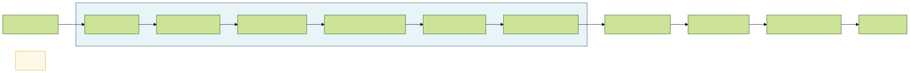


---