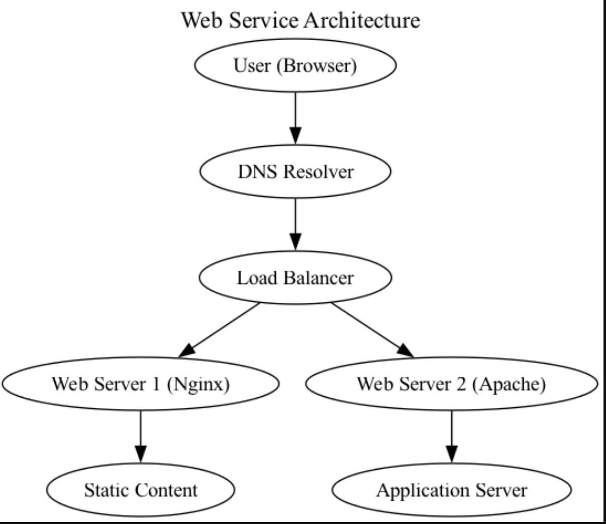

## Systems Architecture

---

## 1. Defense in Depth (DiD)

| **Security Control**               | **Where It Applies**                                                         | **Layer**       |
|------------------------------------|------------------------------------------------------------------------------|-----------------|
| **Firewall / Network ACLs**        | Between the Load Balancer and each web server; around the Application Server | **Network**     |
| **WAF (Web Application Firewall)** | In front of Nginx/Apache or integrated with the Load Balancer                | **Application** |
| **Endpoint Hardening**             | Lock down the OS and packages on the Nginx/Apache servers                    | **Endpoint**    |
| **Intrusion Detection/Prevention** | Network-level or host-based (e.g., Suricata) monitoring traffic              | **Monitoring**  |
| **Encryption in Transit (TLS)**    | Browser → Load Balancer → Web Servers → Application Server                   | **Data**        |
| **Centralized Logging & SIEM**     | Aggregates logs from DNS, Load Balancer, Web/App Servers                     | **Monitoring**  |

---

## 2. Zero Trust Architecture (ZTA)

| **Security Control**              | **Where It Applies**                                                               | **Principle**                  |
|-----------------------------------|------------------------------------------------------------------------------------|--------------------------------|
| **Strict IAM & MFA**              | For all administrative access to servers, load balancer configuration, and DNS     | **Never trust, always verify** |
| **Micro-Segmentation**            | Isolate Nginx from Apache; separate static content server from app server via ACLs | **Micro-segmentation**         |
| **Context-Aware Access Policies** | Based on user/device attributes at the Load Balancer or Identity Proxy             | **Continuous authz**           |
| **Mutual TLS (mTLS)**             | Internal traffic between Web Servers and the Application Server                    | **Encrypt everywhere**         |
| **Just-In-Time (JIT) Privileges** | For maintenance tasks (e.g., SSH to server, config changes)                        | **Least privilege**            |
| **Device Health Checks**          | Health attestation for servers (patch levels, vulnerabilities)                     | **Never trust, always verify** |

---

## 3. Secure Software Development Lifecycle (SSDLC)

| **Security Control**                     | **Where It Applies**                                          | **Phase**        |
|------------------------------------------|---------------------------------------------------------------|------------------|
| **Threat Modeling**                      | Early in design (for the load balancer, web server, app)      | **Requirements** |
| **Static Application Security Testing**  | During coding/build phase for the web app (e.g., scanning)    | **Build/Test**   |
| **Dependency Scanning**                  | CI/CD pipelines whenever new libraries or frameworks are used | **Build/Test**   |
| **Dynamic Application Security Testing** | QA/Testing environment that mimics the load-balanced setup    | **Build/Test**   |
| **Secure Build & Deploy Pipeline**       | Automated pipelines for Nginx config updates, app releases    | **Deploy**       |
| **Secrets Management**                   | Storing credentials (DB passwords, signing keys) securely     | **Release**      |

---

## 4. Zero Knowledge Architecture (ZKA)

| **Security Control**              | **Where It Applies**                                          | **Layer**                 |
|-----------------------------------|---------------------------------------------------------------|---------------------------|
| **Client-Side Encryption**        | For any user-uploaded content or sensitive data at rest       | **Encryption at rest**    |
| **User-Controlled Keys**          | Key management with external KMS/hardware token (BYOK)        | **Key Management**        |
| **End-to-End Encrypted Channels** | Between user’s browser and the final application component    | **Encryption in transit** |
| **No Privileged Backdoors**       | Prevent server admins from accessing plaintext in logs/memory | **Access Control**        |
| **Key Recovery Without Provider** | Secure multi-party backup for user keys                       | **Key Management**        |

---

## 5. Adaptive Security Architecture (ASA)

| **Security Control**                        | **Where It Applies**                                              | **Layer**                 |
|---------------------------------------------|-------------------------------------------------------------------|---------------------------|
| **Continuous Monitoring & Telemetry**       | Collect logs from DNS, Load Balancer, Nginx, Apache, App          | **Continuous Monitoring** |
| **UEBA (User & Entity Behavior Analytics)** | Monitors user/browser activity patterns and server processes      | **Behavioral Analytics**  |
| **Automated Incident Response (SOAR)**      | Orchestrate immediate responses to triggers                       | **Automated Response**    |
| **Dynamic Policy Updating**                 | Adjust firewall/ACL rules, WAF policies, or DNS routes on the fly | **Dynamic Policy Engine** |
| **Threat Intelligence Feeds**               | Feed external intel into the SIEM or WAF                          | **Threat Intelligence**   |
| **Deception Techniques**                    | Deploy decoy resources that mimic web servers or app layers       | **Deception Tech**        |

