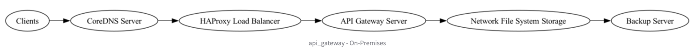

## Systems Architecture

---

## 1. **Defense in Depth (DiD)**

| Security Control                               | Where It Applies                                                               | Layer                     |
|-----------------------------------------------|-------------------------------------------------------------------------------|---------------------------|
| **Firewall & Network Segmentation**           | Between each major component (CoreDNS, HAProxy, API Gateway, NFS, Backup)      | **Network**               |
| **WAF (Web Application Firewall)**            | In front of the API Gateway Server (or integrated with HAProxy)                | **Application**           |
| **Endpoint Hardening**                        | The on-premise hosts (Gateway, DNS server, backup server OS)                   | **Endpoint**             |
| **Encryption in Transit**                     | TLS between Clients→CoreDNS, HAProxy→API Gateway, Gateway→NFS, NFS→Backup      | **Data**                  |
| **Intrusion Detection/Prevention (IDS/IPS)**  | Network-based or host-based, monitoring traffic across load balancer segments  | **Monitoring**            |
| **Centralized Logging & SIEM**                | Logs from CoreDNS, HAProxy, API Gateway, NFS, Backup Server                    | **Monitoring**            |

---

## 2. **Zero Trust Architecture (ZTA)**

| Security Control                  | Where It Applies                                                              | Principle                          |
|----------------------------------|------------------------------------------------------------------------------|------------------------------------|
| **Strong Identity & MFA**        | Administrative access to DNS, HAProxy, Gateway, and file/backup servers      | **Never trust, always verify**     |
| **Micro-Segmentation**           | Strictly limit communications between DNS, HAProxy, Gateway, NFS, Backup      | **Micro-segmentation**             |
| **Least Privilege RBAC**         | Access roles on Gateway, DNS, NFS, Backup (including service accounts)        | **Least privilege**                |
| **Mutual TLS (mTLS)**            | For internal connections (HAProxy→API Gateway, Gateway→NFS)                   | **Encrypt everywhere**             |
| **Device/Host Posture Checks**   | Validate patch levels & security state of each server before allowing access  | **Never trust, always verify**     |
| **Continuous Authentication**    | Re-validate user/process credentials periodically or upon context changes     | **Continuous authz**               |

---

## 3. **Secure Software Development Lifecycle (SSDLC)**

*(Relevant if you are developing or customizing software for the API Gateway or any custom components.)*

| Security Control                      | Where It Applies                                                         | Phase         |
|--------------------------------------|-------------------------------------------------------------------------|--------------|
| **Threat Modeling**                  | Design phase for API Gateway, DNS automation scripts, or backup routines | **Requirements** |
| **SAST & Dependency Scanning**       | Build pipeline for Gateway code or supporting scripts                    | **Build/Test**   |
| **Configuration-as-Code Security Reviews** | DNS (CoreDNS config), HAProxy config, file storage mount scripts        | **Design**       |
| **Secure Secrets Management**        | Credentials for HAProxy, Gateway, NFS, and backup jobs                   | **Release**      |
| **DAST & Penetration Testing**       | Staging environment (HAProxy→Gateway→NFS)                                | **Build/Test**   |
| **Signed Releases/Artifacts**        | For any custom software or configuration “packages”                      | **Deploy**       |

---

## 4. **Zero Knowledge Architecture (ZKA)**

| Security Control                                          | Where It Applies                                                                | Layer/Principle       |
|-----------------------------------------------------------|---------------------------------------------------------------------------------|-----------------------|
| **Client-Side Encryption**                                | If clients are uploading sensitive data ultimately stored on NFS or Backup      | **Encryption at rest**  |
| **User-Controlled Keys (BYOK)**                           | External key management for data stored on NFS or backups                       | **Key Management**      |
| **Encrypted Backups (No Plaintext)**                      | Backup Server enforces encryption at the source, keys controlled externally     | **Encryption at rest**  |
| **Minimal or Redacted Logging**                           | Gateway and NFS logs should avoid storing plaintext or sensitive data fields    | **Auditing**            |
| **No Privileged Administrative Access to Decrypt**        | All encryption operations happen at the client or an isolated key service (HSM) | **Access Control**      |

---

## 5. **Adaptive Security Architecture (ASA)**

| Security Control                                    | Where It Applies                                               | Layer/Principle           |
|-----------------------------------------------------|---------------------------------------------------------------|---------------------------|
| **Continuous Monitoring & Logging**                 | DNS, HAProxy, Gateway, NFS, Backup logs fed into a SIEM       | **Continuous monitoring** |
| **Behavioral Analytics (UEBA)**                     | Tracking usage patterns (DNS requests, LB traffic, file access)| **Behavioral analytics**  |
| **Automated Response (SOAR)**                       | Orchestrate incident responses across DNS, Gateway, NFS, Backup| **Automated response**    |
| **Threat Intelligence Feeds**                       | Incorporated into HAProxy WAF rules, Gateway firewall policies | **Threat intelligence**   |
| **Dynamic Policy Updating**                         | Adjust network ACLs, WAF rules, or DNS responses on the fly    | **Dynamic policy engine** |
| **Deception Techniques (Honeypots)**                | Decoy services or backup share endpoints                       | **Deception tech**        |

