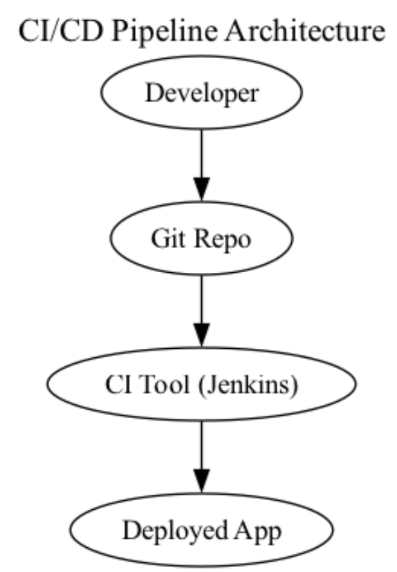

## Systems Architecture

---

## 1. Defense in Depth (DiD)

| **Security Control**           | **Where It Applies**                                                 | **Layer**       |
|--------------------------------|----------------------------------------------------------------------|-----------------|
| **Access Control & Firewalls** | Between Jenkins, the Git Repo, and the deployed environment          | **Network**     |
| **Vulnerability Scanning**     | Jenkins build jobs (code, dependencies, containers)                  | **Monitoring**  |
| **Endpoint Hardening**         | The Jenkins server and any build agents                              | **Endpoint**    |
| **WAF or Reverse Proxy**       | In front of the deployed application                                 | **Application** |
| **Intrusion Detection System** | Monitors the CI/CD network segments                                  | **Monitoring**  |
| **Centralized Logging & SIEM** | Aggregates logs from Git Repo, Jenkins, and the deployed environment | **Monitoring**  |

---

## 2. Zero Trust Architecture (ZTA)

| **Security Control**                   | **Where It Applies**                                          | **Principle**                  |
|----------------------------------------|---------------------------------------------------------------|--------------------------------|
| **Strong IAM + MFA**                   | Developer access to Git, Jenkins admin console, production    | **Never trust, always verify** |
| **Granular RBAC & Policy Enforcement** | Jenkins pipelines and production deployment credentials       | **Least privilege**            |
| **Network Micro-Segmentation**         | Segregate Git, Jenkins, production environment subnets        | **Micro-segmentation**         |
| **Mutual TLS (mTLS)**                  | Jenkins agents ↔ Jenkins master, build artifacts ↔ production | **Encrypt everywhere**         |
| **Device Posture Checks**              | Developer machines, Jenkins hosts                             | **Never trust, always verify** |
| **Continuous Authorization**           | Re-validation on pipeline runs, code pushes                   | **Continuous authz**           |

---

## 3. Secure Software Development Lifecycle (SSDLC)

| **Security Control**                | **Where It Applies**                       | **Phase**               |
|-------------------------------------|--------------------------------------------|-------------------------|
| **Threat Modeling**                 | Early design (for pipeline & app)          | **Requirements/Design** |
| **Code Reviews & SAST**             | Developer → Git Repo (pull requests)       | **Coding**              |
| **Dependency Scanning**             | Jenkins build stage                        | **Build/Test**          |
| **Secure Build & Release Pipeline** | Jenkins pipeline (build, test, deploy)     | **Release**             |
| **DAST & Penetration Testing**      | Test environment for the deployed app      | **Build/Test**          |
| **Secrets Management**              | Jenkins (credentials) and the deployed app | **Deploy**              |

---

## 4. Zero Knowledge Architecture (ZKA)

| **Security Control**                    | **Where It Applies**                                                 | **Layer/Principle**       |
|-----------------------------------------|----------------------------------------------------------------------|---------------------------|
| **Client-Side Encryption of Artifacts** | If developers produce sensitive artifacts or configs before Git push | **Encryption at rest**    |
| **Bring Your Own Keys (BYOK)**          | Secure external KMS for encrypted pipeline artifacts                 | **Key management**        |
| **No Plaintext in Jenkins Logs**        | Jenkins pipeline logging                                             | **Auditing**              |
| **End-to-End Encrypted Communication**  | Developer → Git → Jenkins → Production                               | **Encryption in transit** |
| **Minimal or No Access to Secrets**     | Jenkins master/agents                                                | **Access control**        |

---

## 5. Adaptive Security Architecture (ASA)

| **Security Control**                        | **Where It Applies**                               | **Layer/Principle**       |
|---------------------------------------------|----------------------------------------------------|---------------------------|
| **Real-Time Telemetry & Monitoring**        | Jenkins server, Git Repo events, deployed app logs | **Continuous monitoring** |
| **UEBA (User & Entity Behavior Analytics)** | Developer actions in Git, Jenkins usage            | **Behavioral analytics**  |
| **Automated Incident Response (SOAR)**      | Orchestrated across pipeline and production        | **Automated response**    |
| **Dynamic Policy Updates**                  | Jenkins security settings, production environment  | **Dynamic policy engine** |
| **Threat Intelligence Integration**         | Jenkins or Git hooks, scanning tools               | **Threat intelligence**   |
| **Deception Mechanisms**                    | Honeypot pipeline jobs or decoy repos              | **Deception tech**        |

