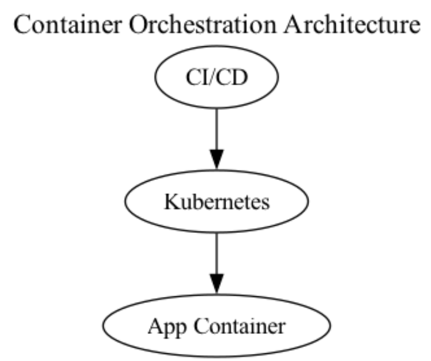

### Systems Architecture

---

### 1. **Defense in Depth (DiD)**

| **Security Control**               | **Where It Applies**                                                           | **Layer**        |
|-----------------------------------|-------------------------------------------------------------------------------|------------------|
| **Container Image Scanning**       | CI/CD pipeline before deploying to Kubernetes                                  | **Application**  |
| **Pod Security / Network Policies** | Kubernetes cluster namespaces (e.g., default, dev, prod)                       | **Network**      |
| **Host-Level Hardening**           | Kubernetes nodes (hosts)—CIS Benchmarks, minimal OS images                      | **Endpoint**     |
| **Ingress/Egress Firewall**        | Between cluster and external networks, node-to-node or namespace boundaries     | **Network**      |
| **Secrets Management (KMS)**       | Encrypted secrets in Kubernetes (e.g., sealed secrets, external vaults)         | **Data**         |
| **Runtime Threat Detection**       | Tools like Falco or Sysdig monitoring real-time container activity             | **Monitoring**   |

---

### 2. **Zero Trust Architecture (ZTA)**

| **Security Control**                | **Where It Applies**                                                              | **Principle**            |
|------------------------------------|-----------------------------------------------------------------------------------|--------------------------|
| **Granular RBAC & IAM**            | Kubernetes RBAC for cluster-level permissions, CI/CD pipeline credentials         | **Least privilege**       |
| **Mutual TLS (mTLS) for Services** | Intra-cluster communications (service-to-service within Kubernetes)               | **Encrypt everywhere**    |
| **Network Micro-Segmentation**     | Enforce with Kubernetes NetworkPolicies (namespace- or pod-level)                 | **Micro-segmentation**    |
| **Just-In-Time (JIT) Privileges**  | Administrative tasks on the cluster (debugging, config changes)                   | **Continuous authz**      |
| **Device/Node Health Checks**      | Validate each Kubernetes node’s posture (patch level, kernel version)             | **Never trust, always verify** |
| **Identity-Aware Proxies**         | Gateway for CI/CD to Kubernetes API                                               | **Never trust, always verify** |

---

### 3. **Secure Software Development Lifecycle (SSDLC)**

| **Security Control**           | **Where It Applies**                                              | **Phase**         |
|-------------------------------|-------------------------------------------------------------------|-------------------|
| **Threat Modeling**           | Early design of microservices, Kubernetes deployment topology      | **Requirements**  |
| **Static & Dynamic Scanning** | CI/CD pipeline (SAST for source code, DAST against staging cluster)| **Build/Test**    |
| **Secure Build & Deployment**  | Automated pipeline for Docker images → Kubernetes                 | **Deploy**        |
| **Dependency & Library Checks**| CI/CD pipeline, scanning container images’ software layers         | **Build/Test**    |
| **Infrastructure as Code (IaC) Security** | Kubernetes YAML/Helm charts, Terraform templates                   | **Design**        |
| **Secrets in Pipelines**       | CI/CD environment storing/using credentials for Kubernetes         | **Build/Test**    |

---

### 4. **Zero Knowledge Architecture (ZKA)**

| **Security Control**             | **Where It Applies**                                                     | **Layer/Principle**          |
|--------------------------------|-------------------------------------------------------------------------|------------------------------|
| **Client-Side Encryption**      | Data handled by the container (user data in volumes or object storage)   | **Encryption at rest**       |
| **BYOK (Bring Your Own Key)**   | Integration with external KMS for container-based encryption             | **Key management**           |
| **Container-Level Encryption**  | Encrypt container file systems (e.g., ephemeral volumes)                 | **Encryption at rest**       |
| **Minimal Logging of Plaintext**| Logging frameworks in container/app code                                 | **Auditing**                 |
| **No Central Access to Secrets**| Prevent operators from decrypting secrets in the cluster                 | **Access control**           |

---

### 5. **Adaptive Security Architecture (ASA)**

| **Security Control**                | **Where It Applies**                                               | **Layer/Principle**         |
|------------------------------------|--------------------------------------------------------------------|-----------------------------|
| **Real-Time Telemetry & Observability** | Kubernetes cluster, CI/CD pipeline                                 | **Continuous monitoring**   |
| **Behavioral Analytics (UEBA)**     | Monitoring container/pod behaviors over time                        | **Behavioral analytics**    |
| **Automated Incident Response (SOAR)** | Orchestrated across nodes, pods, services                           | **Automated response**      |
| **Dynamic Policy Adjustment**      | Network policies, RBAC privileges, container resource limits         | **Dynamic policy engine**   |
| **Deception Pods / Honeypods**     | Decoy pods or services within the cluster                           | **Deception tech**          |
| **Threat Intelligence Integration**| Updating cluster-wide security rules based on external feeds         | **Threat intelligence**     |

