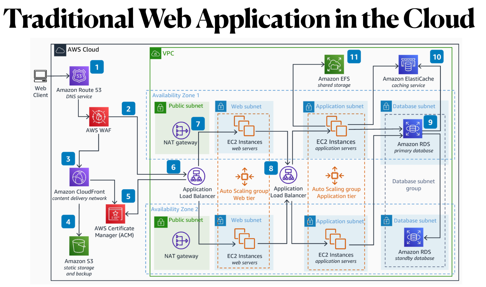

---

**Overview:**

You’ve been provided with a “Traditional Web Application in the Cloud” reference architecture (see attached diagram)
that includes services such as Amazon Route 53 (DNS), AWS WAF, Amazon CloudFront, AWS Certificate Manager, S3, NAT
Gateways, an Application Load Balancer, multiple EC2 tiers (web tier, application tier), Amazon RDS, Amazon ElastiCache,
and Amazon EFS. Your task is to perform an in-depth security architecture analysis comparable to the examples we’ve
discussed (Defense in Depth, Zero Trust, SSDLC, Zero Knowledge Architecture, and Adaptive Security Architecture).

---

### **Part 1: Architectural Overview**

1. **Diagram Interpretation:**
    - Briefly describe the key components in the attached AWS architecture.
    - Note which components reside in public subnets (e.g., load balancer) versus private subnets (e.g., EC2
      application, RDS).
    - Highlight any data flows: inbound from the internet (Route 53 → WAF → CloudFront → ALB), internal flows between
      tiers (web to application, application to database), and outbound flows (NAT gateways).

2. **Threat Surfaces:**
    - Identify at least **three** potential attack vectors in this architecture (e.g., an attacker targeting the
      application load balancer, malicious traffic at the WAF, or unauthorized access to S3).

---

### **Part 2: Architecture Analysis**

Using each of the five major cybersecurity architecture approaches below, **propose** a set of security controls or best
practices that address threats relevant to this AWS-based web application. For every control, briefly explain **what it
does** and **why** it’s important in this environment.

1. **Defense in Depth (DiD)**
    - **Goal**: Multiple, independent security layers that contain or mitigate breaches if one layer fails.
    - **Deliverable**: Construct a table listing at least **five** DiD controls (e.g., firewalls, intrusion detection,
      network segmentation). Include a short rationale or “reason for selection.”

2. **Zero Trust Architecture (ZTA)**
    - **Goal**: “Never trust, always verify” with continuous identity verification and micro-segmentation.
    - **Deliverable**: Show how Zero Trust applies to at least **four** aspects of the environment (e.g., strong IAM,
      mutual TLS, least-privilege roles). Clarify which AWS services or design principles you’d leverage.

3. **Secure Software Development Lifecycle (SSDLC)**
    - **Goal**: Integrate security throughout requirements, design, coding, testing, deployment, and maintenance.
    - **Deliverable**: Identify **four** SSDLC controls or processes you would implement specifically for a cloud-based
      web application (e.g., threat modeling, SAST/DAST scanning, IaC scanning, secrets management).

4. **Zero Knowledge Architecture (ZKA)**
    - **Goal**: Ensure that even the cloud provider or system admins cannot decrypt user data (where feasible).
    - **Deliverable**: Recommend at least **three** techniques (e.g., client-side encryption, BYOK, minimal plaintext
      logging) that approximate Zero Knowledge in AWS. Note any limitations or complexities (e.g., using AWS KMS vs.
      external KMS).

5. **Adaptive Security Architecture (ASA)**
    - **Goal**: Continuous monitoring and automated response, adjusting defenses in real time.
    - **Deliverable**: Propose at least **four** ASA controls (e.g., real-time telemetry, automated incident response,
      deception techniques). Discuss how you’d leverage AWS services like GuardDuty, Security Hub, or third-party tools.

---

### **Part 3: Synthesis & Reflection**

1. **Cross-Architecture Insights:**
    - Which controls seem most critical for high-risk areas (e.g., public-facing ALB, database access, S3 buckets)?
    - Highlight any **overlaps** or **dependencies** among your chosen DiD, ZTA, SSDLC, ZKA, and ASA controls. For
      instance, a Zero Trust micro-segmentation approach might also support some DiD strategies.

2. **AWS Services and Best Practices:**
    - Recommend specific AWS features or best practices that reinforce your proposed controls (e.g., AWS WAF for DiD,
      VPC Security Groups for micro-segmentation, CodePipeline scanning for SSDLC, KMS with customer keys for partial
      ZKA, GuardDuty or Security Hub for ASA).

3. **Challenges & Trade-offs:**
    - Conclude by noting potential **challenges** (e.g., increased complexity, cost, operational overhead, user
      friction) and **trade-offs** (e.g., performance vs. encryption overhead, the practicality of “pure” Zero Knowledge
      in a multi-tier environment).

---

### **Submission Guidelines**

- **Format**: Submit a report incorporating your tables and explanations.
- **References**: Cite any AWS documentation, NIST standards, academic papers, or other authoritative sources that
  shaped your security recommendations.
- **Rubric**:
    - **Clarity & Organization** (20%)
    - **Depth of Technical Analysis** (30%)
    - **Completeness of Proposed Controls** (30%)
    - **Critical Reasoning & Trade-off Discussion** (20%)

